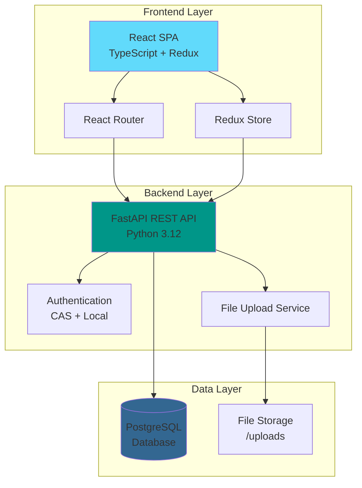
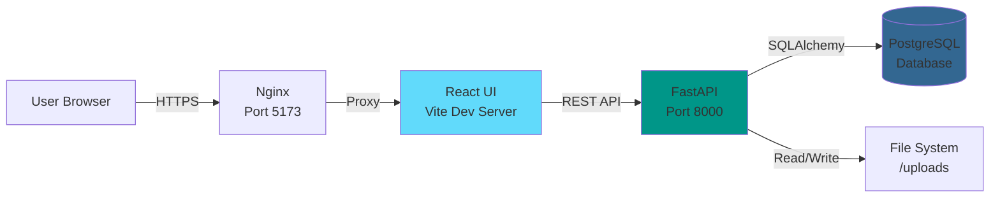

# Genji - Document Annotation Platform

[](https://fastapi.tiangolo.com/)
[](https://reactjs.org/)
[](https://www.typescriptlang.org/)
[](https://www.postgresql.org/)
[](https://www.docker.com/)

Genji is a comprehensive document annotation platform designed for educational environments. It enables users to upload, view, annotate, and collaborate on documents with features like classroom management, role-based permissions, and advanced search capabilities.

---

## 📚 Table of Contents

- [Features](#-features)
- [Architecture](#-architecture)
- [Tech Stack](#-tech-stack)
- [Quick Start](#-quick-start)
- [Project Structure](#-project-structure)
- [Documentation](#-documentation)
- [Development](#-development)
- [API Documentation](#-api-documentation)
- [Contributing](#-contributing)
- [License](#-license)

---

## ✨ Features

### Core Functionality
- **📄 Document Management**: Upload, organize, and manage documents in collections
- **✍️ Annotations**: Create, view, and manage document annotations with rich metadata
- **🏫 Classroom Management**: Organize users into classrooms/groups with role-based access
- **🔍 Search**: Powerful search across documents, annotations, and collections
- **👥 User Management**: Role-based permissions (admin, instructor, student)
- **🔐 Authentication**: Dual authentication system (CAS + local auth)
- **🏷️ Flags**: Tag and categorize content for easy filtering
- **⚙️ Site Settings**: Configurable platform settings

### User Roles
- **Admin**: Full system access, user management, site configuration
- **Instructor**: Classroom management, student oversight, content creation
- **Student**: Document viewing, annotation creation, collaboration

---

## 🏗️ Architecture

Genji follows a modern three-tier architecture:



### System Overview



---

## 🛠️ Tech Stack

### Backend (api/)
| Technology | Version | Purpose |
|------------|---------|---------|
| **FastAPI** | Latest | REST API framework with automatic OpenAPI docs |
| **Python** | 3.12 | Programming language |
| **SQLAlchemy** | Latest | ORM for database interactions |
| **Alembic** | Latest | Database migration management |
| **PostgreSQL** | 15+ | Relational database |
| **Pydantic** | Latest | Data validation and serialization |
| **python-jose** | Latest | JWT token handling |
| **Passlib** | 1.7.4 | Password hashing with bcrypt |
| **python-docx** | Latest | Document processing |
| **Pillow** | Latest | Image processing |

### Frontend (core-ui/)
| Technology | Version | Purpose |
|------------|---------|---------|
| **React** | 19.0 | UI framework |
| **TypeScript** | 5.7 | Type-safe JavaScript |
| **Redux Toolkit** | 2.6+ | State management |
| **React Router** | 7.6+ | Client-side routing |
| **Material-UI** | 6.4+ | Component library |
| **Axios** | 1.8+ | HTTP client |
| **Vite** | 6.2+ | Build tool and dev server |
| **Rangy** | 1.3.2 | Text selection and ranges |

### Infrastructure
- **Docker** & **Docker Compose** - Containerization and orchestration
- **Nginx** - Reverse proxy and static file serving
- **Uvicorn** - ASGI server for FastAPI

---

## 🚀 Quick Start

### Prerequisites

- **Docker Desktop** or **Docker Engine** + **Docker Compose** v2.0+
- **Git**
- (Optional) **Python 3.12+** and **Node.js 18+** for local development

### 1. Clone the Repository

```bash
git clone https://github.com/dartmouth-itc/rc-genji.git
cd rc-genji
```

### 2. Configure Environment Variables

```bash
# Backend configuration
cd api
cp .env_sample .env
# Edit .env with your database credentials and secrets
```

**Required Environment Variables:**
- `DATABASE_URL` - PostgreSQL connection string
- `SESSION_SECRET_KEY` - Secret key for session management
- `CAS_SERVER_URL` - CAS authentication server URL (if using CAS)
- `SECRET_KEY` - JWT signing key

### 3. Start with Docker Compose

```bash
# From project root
docker compose up
```

This will start:
- **React UI** on http://localhost:5173
- **FastAPI** on http://localhost:8000
- **API Docs** on http://localhost:8000/docs (Swagger UI)

### 4. Run Database Migrations

```bash
docker compose run --remove-orphans migrations upgrade head
```

### 5. Access the Application

- **Frontend**: http://localhost:5173
- **API**: http://localhost:8000
- **API Documentation**: http://localhost:8000/docs
- **API Alternative Docs**: http://localhost:8000/redoc

### First Login

Create an admin user through the registration form or use SQL:

```sql
-- Connect to your PostgreSQL database
INSERT INTO app.users (username, email, first_name, last_name, is_active)
VALUES ('admin', 'admin@example.com', 'Admin', 'User', true);
```

---

## 📁 Project Structure

```
rc-genji/
├── api/                          # Backend FastAPI application
│   ├── main.py                   # FastAPI app entry point
│   ├── database.py               # Database configuration
│   ├── requirements.txt          # Python dependencies
│   ├── alembic.ini              # Alembic configuration
│   ├── Dockerfile               # API production Docker image
│   ├── Dockerfile.migrations    # Migrations Docker image
│   ├── .env                     # Environment variables (create from .env_sample)
│   ├── models/                  # SQLAlchemy models
│   │   └── models.py            # Database models
│   ├── schemas/                 # Pydantic schemas
│   ├── routers/                 # API route handlers
│   │   ├── annotations.py       # Annotation endpoints
│   │   ├── auth.py              # Local authentication
│   │   ├── cas_auth.py          # CAS authentication
│   │   ├── documents.py         # Document management
│   │   ├── document_collections.py  # Collections
│   │   ├── document_elements.py # Document elements
│   │   ├── flags.py             # Content flags
│   │   ├── groups.py            # Classroom/group management
│   │   ├── roles.py             # Role management
│   │   ├── search.py            # Search functionality
│   │   ├── site_settings.py     # Site configuration
│   │   └── users.py             # User management
│   ├── dependencies/            # Shared dependencies
│   │   └── classroom.py         # Classroom context & auth
│   ├── alembic/                 # Database migrations
│   │   └── versions/            # Migration files
│   ├── data/                    # Data files and notebooks
│   └── uploads/                 # User uploaded files
│
├── core-ui/                     # Frontend React application
│   ├── src/
│   │   ├── App.tsx              # Main application component
│   │   ├── main.tsx             # React entry point
│   │   ├── RouterSwitchBoard.tsx # Routing configuration
│   │   ├── components/          # Shared components
│   │   │   ├── AppHeader.tsx    # Application header
│   │   │   ├── AuthContext.tsx  # Auth context provider
│   │   │   ├── LoginForm.tsx    # Login component
│   │   │   └── RegisterForm.tsx # Registration component
│   │   ├── features/            # Feature modules
│   │   │   ├── admin/           # Admin panel
│   │   │   │   └── components/  # Admin components
│   │   │   ├── documentGallery/ # Document gallery
│   │   │   ├── documentView/    # Document viewer
│   │   │   └── search/          # Search interface
│   │   ├── store/               # Redux store
│   │   │   ├── slice/           # Redux slices
│   │   │   ├── thunk/           # Async thunks
│   │   │   └── selector/        # Selectors
│   │   ├── hooks/               # Custom React hooks
│   │   ├── types/               # TypeScript types
│   │   └── utils/               # Utility functions
│   ├── package.json             # Node dependencies
│   ├── vite.config.ts           # Vite configuration
│   ├── tsconfig.json            # TypeScript configuration
│   ├── Dockerfile               # Production Docker image
│   ├── Dockerfile.dev           # Development Docker image
│   └── nginx.conf               # Nginx configuration
│
├── docs/                        # Project documentation
│   ├── DOCUMENTATION_PLAN.md    # Documentation strategy
│   ├── api/                     # API documentation
│   ├── frontend/                # Frontend documentation
│   ├── database/                # Database documentation
│   ├── architecture/            # Architecture diagrams
│   ├── guides/                  # How-to guides
│   └── audits/                  # Code audit reports
│
├── docker-compose.yml           # Docker services configuration
└── README.md                    # This file
```

---

## 📖 Documentation

Comprehensive documentation is available in the `/docs` directory:

### For Developers
- **[Documentation Plan](docs/DOCUMENTATION_PLAN.md)** - Overall documentation strategy
- **[API Documentation](docs/api/)** - Backend API reference
- **[Frontend Documentation](docs/frontend/)** - React architecture
- **[Database Documentation](docs/database/)** - Schema and models
- **[Architecture Documentation](docs/architecture/)** - System design

### Guides
- **[Development Setup](docs/guides/DEVELOPMENT_SETUP.md)** - Local environment setup
- **[Docker Guide](docs/guides/DOCKER_GUIDE.md)** - Docker usage
- **[Common Tasks](docs/guides/COMMON_TASKS.md)** - Frequent operations

### Code Quality
- **[Code Audits](docs/audits/)** - Code analysis and recommendations

---

## 💻 Development

### Local Development (Without Docker)

#### Backend Setup

```bash
cd api

# Create virtual environment
python -m venv env
source env/bin/activate  # On Windows: .\env\Scripts\activate

# Install dependencies
pip install -r requirements.txt

# Run database migrations
alembic upgrade head

# Start development server
uvicorn main:app --reload --host 0.0.0.0 --port 8000
```

#### Frontend Setup

```bash
cd core-ui

# Install dependencies
npm install

# Start development server
npm run dev
```

### Docker Development

```bash
# Start all services
docker compose up

# Start specific service
docker compose up api
docker compose up ui

# Rebuild after dependency changes
docker compose build

# View logs
docker compose logs -f api
docker compose logs -f ui

# Stop services
docker compose down

# Stop and remove volumes
docker compose down -v
```

### Database Migrations

```bash
# Generate new migration
docker compose run --remove-orphans migrations revision --autogenerate -m "Description"

# Apply migrations
docker compose run --remove-orphans migrations upgrade head

# Rollback one migration
docker compose run --remove-orphans migrations downgrade -1

# View migration history
docker compose run --remove-orphans migrations history

# Check current version
docker compose run --remove-orphans migrations current
```

### Running Tests

```bash
# Backend tests
cd api
pytest

# Frontend tests
cd core-ui
npm run test
```

---

## 📡 API Documentation

The API is fully documented with **OpenAPI/Swagger**:

- **Interactive Docs**: http://localhost:8000/docs
- **Alternative Docs**: http://localhost:8000/redoc
- **OpenAPI Schema**: http://localhost:8000/openapi.json

### API Endpoints Overview

#### Authentication
- `POST /api/v1/register` - Register new user
- `POST /api/v1/login` - Local authentication
- `POST /api/v1/validate-cas-ticket` - CAS authentication
- `GET /api/v1/me` - Get current user
- `POST /api/v1/logout` - Logout user
- `POST /api/v1/change-password` - Change password

#### Documents
- `POST /api/v1/documents/` - Upload document
- `GET /api/v1/documents/` - List documents
- `GET /api/v1/documents/{id}` - Get document
- `PUT /api/v1/documents/{id}` - Update document
- `DELETE /api/v1/documents/{id}` - Delete document

#### Document Collections
- `POST /api/v1/document-collections/` - Create collection
- `GET /api/v1/document-collections/` - List collections
- `GET /api/v1/document-collections/{id}` - Get collection
- `PUT /api/v1/document-collections/{id}` - Update collection
- `DELETE /api/v1/document-collections/{id}` - Delete collection

#### Annotations
- `POST /api/v1/annotations/` - Create annotation
- `GET /api/v1/annotations/` - List annotations
- `GET /api/v1/annotations/{id}` - Get annotation
- `PUT /api/v1/annotations/{id}` - Update annotation
- `DELETE /api/v1/annotations/{id}` - Delete annotation

#### Groups/Classrooms
- `POST /api/v1/groups/` - Create group
- `GET /api/v1/groups/` - List groups
- `GET /api/v1/groups/{id}` - Get group
- `POST /api/v1/groups/{id}/members` - Add member
- `DELETE /api/v1/groups/{id}/members/{user_id}` - Remove member

#### Search
- `GET /api/v1/search/` - Search across all content

#### Users & Roles
- `GET /api/v1/users/` - List users
- `GET /api/v1/roles/` - List roles
- `POST /api/v1/users/{user_id}/roles` - Assign role

---

## 🔐 Authentication

Genji supports two authentication methods:

### 1. Local Authentication
- Username/email and password
- Bcrypt password hashing
- JWT session tokens

### 2. CAS (Central Authentication Service)
- Integration with institutional CAS servers
- Single sign-on support
- Configured via `CAS_SERVER_URL` environment variable

---

## 🎨 Frontend Architecture

### State Management

The frontend uses **Redux Toolkit** with the following slices:

- `annotationCreate` - Annotation creation state
- `annotationRegistry` - Annotation data registry
- `classroomsSlice` - Classroom management
- `documentCollectionSlice` - Collection state
- `documentElementsSlice` - Document elements
- `documentNavigationSlice` - Navigation state
- `documentSlice` - Document data
- `highlightRegistrySlice` - Text highlights
- `navigationHighlightSlice` - Navigation highlights
- `rolesSlice` - User roles
- `searchResultsSlice` - Search results
- `siteSettingsSlice` - Site configuration
- `usersSlice` - User data

### Routing

React Router manages client-side routing with routes for:
- Document gallery
- Document viewer
- Document comparison
- Admin panel
- Search interface
- User authentication

---

## 🧪 Testing

### Backend Testing
```bash
cd api
pytest tests/
```

### Frontend Testing
```bash
cd core-ui
npm run test
```

---

## 🚢 Deployment

### Production Build

#### Backend
```bash
cd api
docker build -t genji-api:latest .
```

#### Frontend
```bash
cd core-ui
npm run build
docker build -t genji-ui:latest .
```

### Environment Configuration

Ensure all production environment variables are set:
- Strong `SESSION_SECRET_KEY`
- Strong `SECRET_KEY` for JWT
- Production database credentials
- CORS origins restricted to your domain
- CAS configuration (if using)

### Database Initialization

```bash
# Run migrations
docker compose run migrations upgrade head

# Create admin user (SQL or API endpoint)
```

---

## 📊 Database Schema

The application uses PostgreSQL with an `app` schema containing:

### Core Tables
- `users` - User accounts
- `user_passwords` - Password storage
- `roles` - User roles (admin, instructor, student)
- `permissions` - Permission definitions
- `groups` - Classrooms/groups
- `documents` - Uploaded documents
- `document_collections` - Document collections
- `document_elements` - Document structure elements
- `annotations` - User annotations
- `annotation_bodies` - Annotation content
- `annotation_targets` - Annotation targets
- `flags` - Content flags
- `site_settings` - Platform configuration

### Key Relationships
- Users have many-to-many relationships with roles and groups
- Documents belong to collections and have owners
- Annotations link users to document elements
- Groups manage classroom memberships

See [Database Documentation](docs/database/SCHEMA.md) for detailed schema information.

---

## 🤝 Contributing

We welcome contributions! Please see our [Contributing Guidelines](docs/CONTRIBUTING.md) (coming soon).

### Development Workflow
1. Fork the repository
2. Create a feature branch (`git checkout -b feature/amazing-feature`)
3. Make your changes
4. Run tests and linting
5. Commit your changes (`git commit -m 'Add amazing feature'`)
6. Push to the branch (`git push origin feature/amazing-feature`)
7. Open a Pull Request

### Code Standards
- **Backend**: Follow PEP 8 style guide
- **Frontend**: ESLint configuration in `eslint.config.js`
- **TypeScript**: Strict mode enabled
- **Commits**: Descriptive commit messages

---

## 📝 License

[Add your license information here]

---

## 👥 Team

**Organization**: Dartmouth ITC  
**Repository**: [dartmouth-itc/rc-genji](https://github.com/dartmouth-itc/rc-genji)

---

## 📞 Support

- **Documentation**: [/docs](./docs/)
- **Issues**: [GitHub Issues](https://github.com/dartmouth-itc/rc-genji/issues)
- **API Docs**: http://localhost:8000/docs (when running)

---

## 🗺️ Roadmap

- [ ] Complete comprehensive documentation
- [ ] Code audit and cleanup
- [ ] Performance optimization
- [ ] Expanded test coverage
- [ ] Enhanced search capabilities
- [ ] Real-time collaboration features
- [ ] Mobile responsive improvements

---

**Last Updated**: October 22, 2025  
**Version**: 1.0.0
