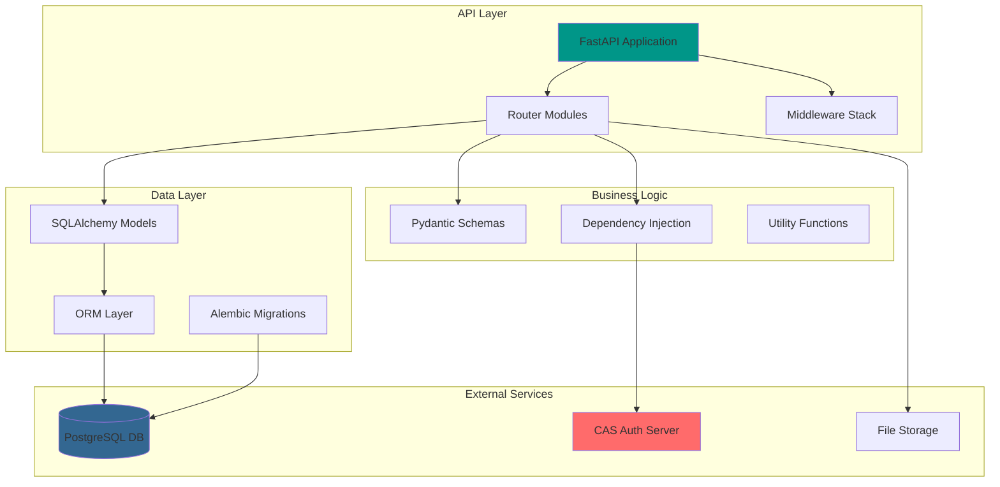
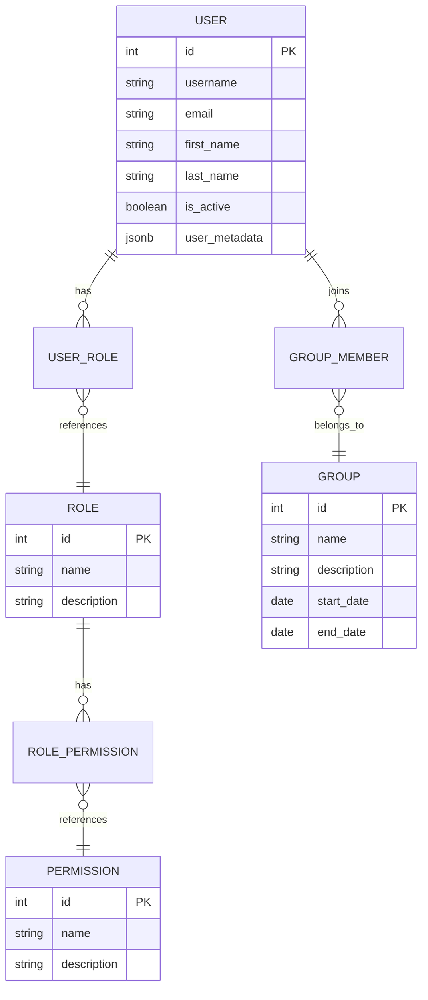
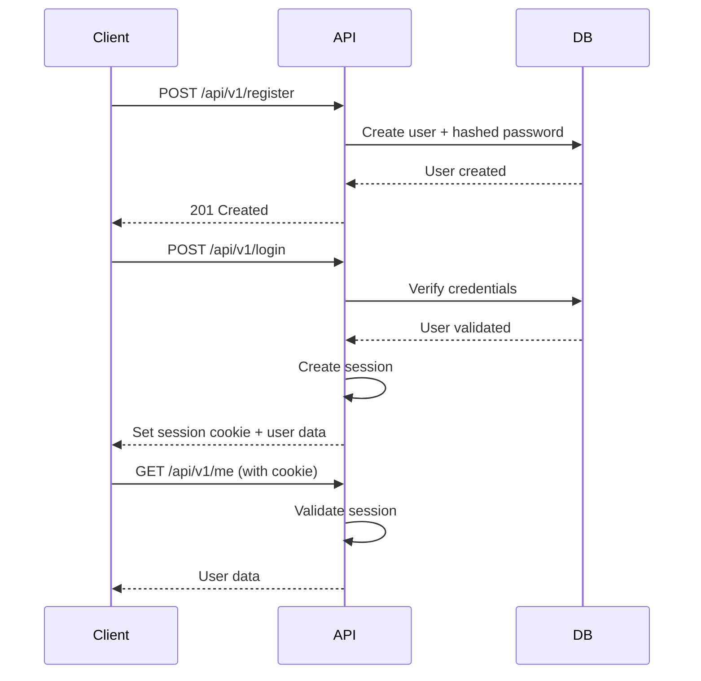
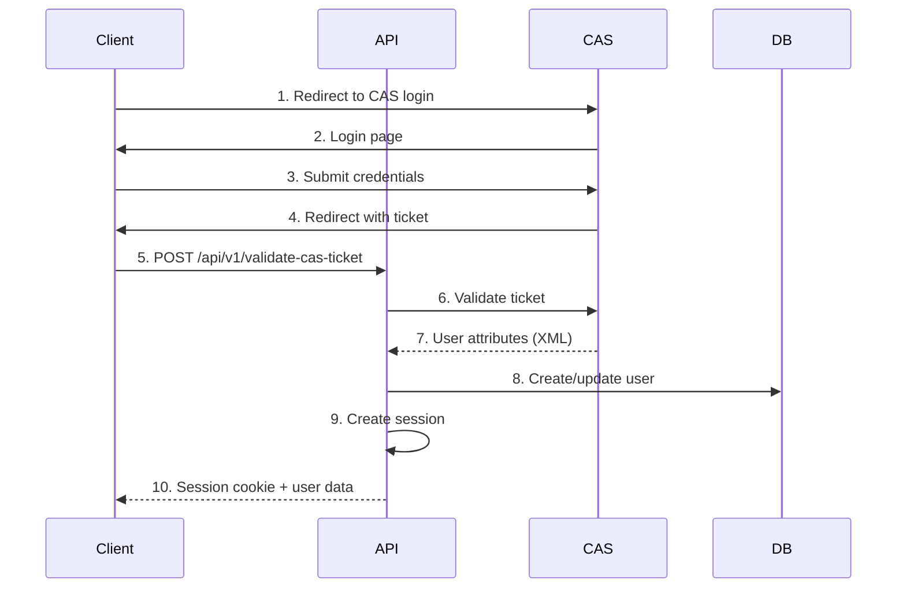
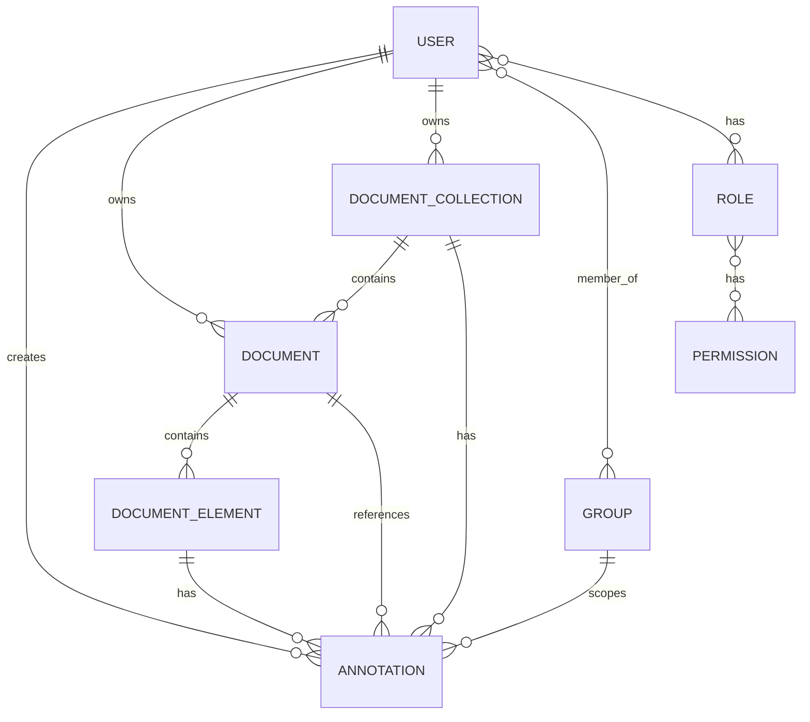

# API Documentation Overview

**Project**: Genji Document Annotation Platform  
**API Framework**: FastAPI 0.104+  
**Python Version**: 3.12  
**Database**: PostgreSQL with SQLAlchemy ORM

---

## Table of Contents

1. [Architecture Overview](#architecture-overview)
2. [Project Structure](#project-structure)
3. [Core Concepts](#core-concepts)
4. [Authentication System](#authentication-system)
5. [Database Models](#database-models)
6. [Router Modules](#router-modules)
7. [API Endpoints Summary](#api-endpoints-summary)
8. [Request/Response Patterns](#requestresponse-patterns)
9. [Error Handling](#error-handling)
10. [Development Guidelines](#development-guidelines)

---

## Architecture Overview

### Technology Stack



### Key Components

| Component | Technology | Purpose |
|-----------|------------|---------|
| **Web Framework** | FastAPI | REST API, auto-documentation, async support |
| **ORM** | SQLAlchemy 2.0 | Database abstraction, relationship management |
| **Validation** | Pydantic v2 | Request/response validation, serialization |
| **Migrations** | Alembic | Database schema versioning |
| **Authentication** | JWT + CAS | Dual auth system (local + institutional) |
| **Password Hashing** | Passlib + bcrypt | Secure password storage |
| **ASGI Server** | Uvicorn | High-performance async server |
| **Session Management** | Starlette Sessions | Cookie-based sessions |

---

## Project Structure

```
api/
├── main.py                      # FastAPI application entry point
├── database.py                  # Database configuration & session management
├── requirements.txt             # Python dependencies
├── alembic.ini                 # Alembic configuration
├── .env                        # Environment variables (not in git)
├── .env_sample                 # Environment template
│
├── models/                      # SQLAlchemy ORM models
│   └── models.py               # All database models (281 lines)
│
├── schemas/                     # Pydantic validation schemas
│   ├── annotations.py          # Annotation request/response schemas
│   ├── auth.py                 # Authentication schemas
│   ├── documents.py            # Document schemas
│   ├── document_collections.py # Collection schemas
│   ├── document_elements.py    # Element schemas
│   ├── roles.py                # Role schemas
│   ├── search.py               # Search query schemas
│   ├── site_settings.py        # Settings schemas
│   └── users.py                # User schemas
│
├── routers/                     # API route handlers
│   ├── annotations.py          # Annotation CRUD & queries (514 lines)
│   ├── auth.py                 # Local authentication
│   ├── cas_auth.py             # CAS authentication
│   ├── cas_config.py           # CAS configuration management
│   ├── auth_utils.py           # Shared auth utilities
│   ├── documents.py            # Document management
│   ├── document_collections.py # Collection management
│   ├── document_elements.py    # Element management
│   ├── flags.py                # Content flagging
│   ├── groups.py               # Classroom/group management
│   ├── roles.py                # Role management
│   ├── search.py               # Search functionality (231 lines)
│   ├── site_settings.py        # Site configuration
│   └── users.py                # User management
│
├── services/                    # Business logic layer
│   ├── annotation_service.py   # Annotation business logic
│   ├── annotation_query_service.py # Annotation query helpers
│   ├── auth_service.py         # Authentication logic
│   ├── cas_auth_service.py     # CAS authentication logic
│   ├── cas_config_service.py   # CAS configuration logic
│   ├── classroom_service.py    # Classroom business logic
│   ├── document_service.py     # Document business logic
│   ├── document_collection_service.py # Collection logic
│   ├── document_element_service.py # Element logic
│   ├── flag_service.py         # Flag management logic
│   ├── group_service.py        # Group management logic
│   ├── role_service.py         # Role management logic
│   ├── search_service.py       # Search logic
│   ├── site_settings_service.py # Settings logic
│   ├── user_service.py         # User management logic
│   └── base_service.py         # Base service patterns
│
├── dependencies/                # FastAPI dependencies
│   └── classroom.py            # Classroom context & auth helpers
│
├── alembic/                     # Database migrations
│   ├── versions/               # Migration files
│   └── env.py                  # Alembic environment config
│
├── tests/                       # Test suite
│   ├── conftest.py             # Pytest fixtures & configuration
│   ├── pytest.ini              # Pytest settings
│   ├── unit/                   # Unit tests
│   │   ├── test_*_schemas.py  # Schema validation tests
│   │   ├── test_*_service.py  # Service layer tests
│   │   └── test_auth_utils.py # Auth utility tests
│   └── integration/            # Integration tests
│       └── test_*_endpoints.py # API endpoint tests
│
├── data/                        # Data files
│   ├── *.json                  # Sample documents (p0-p117)
│   ├── annotations/            # Annotation data
│   ├── content/                # Document content
│   └── text_collections/       # Text collection data
```

---

## Core Concepts

### 1. Document Hierarchy

The Genji platform organizes content in a hierarchical structure:

```
DocumentCollection
    └── Document (1..n)
            └── DocumentElement (1..n)
                    └── Annotation (0..n)
```

**DocumentCollection**:
- Top-level container for related documents
- Has title, visibility settings, language, metadata
- Owned by a user, can be shared with groups
- Example: "American Literature Course - Fall 2025"

**Document**:
- Individual document within a collection
- Has title, description, creation/modification dates
- Belongs to exactly one collection
- Example: "The Great Gatsby - Chapter 1"

**DocumentElement**:
- Granular content unit (paragraph, section, etc.)
- Contains actual text content with formatting
- Has hierarchical position (e.g., chapter 1, paragraph 5)
- Stored as JSONB for flexibility

**Annotation**:
- User-generated content attached to document elements
- Can be comments, highlights, tags, questions, etc.
- Has motivation (commenting, tagging, questioning, etc.)
- Supports collaborative features via classrooms

---

### 2. User & Permission System



**Roles** (Typical setup):
- **Admin**: Full system access, user management, site configuration
- **Instructor**: Classroom creation, student management, content oversight
- **Student**: Document viewing, annotation creation, collaboration

**Groups/Classrooms**:
- Organize users for collaborative work
- Have start/end dates (e.g., semester-based)
- Annotations can be scoped to specific classrooms
- Enables instructor oversight of student work

---

### 3. Annotation Model

Annotations follow the [Web Annotation Data Model](https://www.w3.org/TR/annotation-model/):

```json
{
  "id": 123,
  "type": "Annotation",
  "motivation": "commenting",
  "created": "2025-10-22T10:30:00Z",
  "creator": {
    "id": 5,
    "username": "student01",
    "name": "John Doe"
  },
  "body": {
    "type": "TextualBody",
    "value": "This passage demonstrates the theme of...",
    "format": "text/plain"
  },
  "target": {
    "source": "document_element:42",
    "selector": {
      "type": "TextQuoteSelector",
      "exact": "selected text",
      "prefix": "context before",
      "suffix": "context after"
    }
  }
}
```

**Motivation Types**:
- `commenting` - User comments/notes
- `highlighting` - Text highlights
- `tagging` - Content tags/labels
- `questioning` - Student questions
- `replying` - Responses to other annotations
- `linking` - Cross-references

---

## Authentication System

Genji supports **dual authentication**:

### 1. Local Authentication (Password-based)

**Flow**:


**Endpoints**:
- `POST /api/v1/register` - Create new user with password
- `POST /api/v1/login` - Authenticate with username/password
- `POST /api/v1/change-password` - Update password
- `GET /api/v1/me` - Get current user
- `POST /api/v1/logout` - End session

**Security**:
- Passwords hashed with bcrypt (cost factor 12)
- Session cookies (httponly, secure in production)
- Rate limiting recommended (TODO)

---

### 2. CAS Authentication (Institutional SSO)

**Flow**:


**Configuration**:
```python
# Environment variables required:
CAS_SERVER_URL=https://login.dartmouth.edu/cas
CAS_VALIDATE_URL=https://login.dartmouth.edu/cas/serviceValidate
```

**Endpoint**:
- `POST /api/v1/validate-cas-ticket` - Validate CAS service ticket

**User Creation**:
- If user doesn't exist, automatically created from CAS attributes
- User data synchronized with institutional directory
- No password stored (auth delegated to CAS)

---

## Database Models

### Core Models Summary

| Model | Purpose | Key Relationships |
|-------|---------|-------------------|
| **User** | User accounts | Has roles, groups, annotations, documents |
| **UserPassword** | Password storage | One-to-one with User |
| **Role** | User roles | Many-to-many with Users, Permissions |
| **Permission** | Access rights | Many-to-many with Roles |
| **Group** | Classrooms/teams | Many-to-many with Users |
| **DocumentCollection** | Document containers | Has Documents, owned by User |
| **Document** | Individual documents | Belongs to Collection, has Elements |
| **DocumentElement** | Content units | Belongs to Document, has Annotations |
| **Annotation** | User annotations | References Element, User, Collection |
| **ObjectSharing** | Sharing permissions | Links objects to users/groups |
| **SiteSettings** | Platform config | Singleton configuration |

### Database Schema



See [Database Documentation](../database/SCHEMA.md) for detailed schema information.

---

## Router Modules

### Router Organization

Each router handles a specific resource or feature:

| Router | Prefix | Lines | Purpose |
|--------|--------|-------|---------|
| **annotations.py** | `/api/v1/annotations` | 514 | Annotation CRUD, queries by element/motivation |
| **auth.py** | `/api/v1/` | ~200 | Local authentication (register, login, logout) |
| **cas_auth.py** | `/api/v1/` | ~250 | CAS authentication integration |
| **cas_config.py** | `/api/v1/cas-config` | ~50 | CAS configuration management |
| **documents.py** | `/api/v1/documents` | ~530 | Document upload, CRUD, element extraction |
| **document_collections.py** | `/api/v1/document-collections` | ~410 | Collection management |
| **document_elements.py** | `/api/v1/document-elements` | ~450 | Element CRUD, content queries |
| **flags.py** | `/api/v1/flags` | ~100 | Content flagging system |
| **groups.py** | `/api/v1/groups` | ~300 | Classroom/group management |
| **roles.py** | `/api/v1/roles` | ~50 | Role listing |
| **search.py** | `/api/v1/search` | 231 | Full-text search across content |
| **site_settings.py** | `/api/v1/site-settings` | ~150 | Site configuration API |
| **users.py** | `/api/v1/users` | ~200 | User management CRUD |

### Common Patterns

All routers follow consistent patterns:

#### 1. Router Definition
```python
from fastapi import APIRouter, Depends, HTTPException, status
from sqlalchemy.orm import Session
from database import get_db

router = APIRouter(
    prefix="/api/v1/resource",
    tags=["resource"],
    responses={404: {"description": "Not found"}},
)
```

#### 2. Dependency Injection
```python
from dependencies.classroom import get_current_user_sync

@router.get("/")
def list_resources(
    current_user: User = Depends(get_current_user_sync),
    db: Session = Depends(get_db),
):
    # Endpoint logic
```

#### 3. CRUD Operations
```python
# CREATE
@router.post("/", response_model=ResourceSchema, status_code=status.HTTP_201_CREATED)

# READ (list)
@router.get("/", response_model=List[ResourceSchema])

# READ (single)
@router.get("/{id}", response_model=ResourceSchema)

# UPDATE (full)
@router.put("/{id}", response_model=ResourceSchema)

# UPDATE (partial)
@router.patch("/{id}", response_model=ResourceSchema)

# DELETE
@router.delete("/{id}", status_code=status.HTTP_204_NO_CONTENT)
```

---

## API Endpoints Summary

### Authentication Endpoints

| Method | Endpoint | Description | Auth Required |
|--------|----------|-------------|---------------|
| POST | `/api/v1/register` | Create new user account | No |
| POST | `/api/v1/login` | Authenticate with password | No |
| POST | `/api/v1/validate-cas-ticket` | Validate CAS ticket | No |
| GET | `/api/v1/cas-config/public` | Get public CAS config | No |
| GET | `/api/v1/me` | Get current user info | Yes |
| GET | `/api/v1/cas-config` | Get CAS configuration | Yes |
| PUT | `/api/v1/cas-config` | Update CAS configuration | Yes (Admin) |
| POST | `/api/v1/change-password` | Update password | Yes |
| POST | `/api/v1/logout` | End session | Yes |

### Document Endpoints

| Method | Endpoint | Description | Auth Required |
|--------|----------|-------------|---------------|
| POST | `/api/v1/documents/` | Upload document | Yes |
| GET | `/api/v1/documents/` | List documents | Yes |
| GET | `/api/v1/documents/{id}` | Get document | Yes |
| PUT | `/api/v1/documents/{id}` | Update document | Yes |
| PATCH | `/api/v1/documents/{id}` | Partial update | Yes |
| DELETE | `/api/v1/documents/{id}` | Delete document | Yes |
| GET | `/api/v1/documents/{id}/elements` | Get document elements | Yes |
| POST | `/api/v1/documents/upload` | Upload and process | Yes |

### Collection Endpoints

| Method | Endpoint | Description | Auth Required |
|--------|----------|-------------|---------------|
| POST | `/api/v1/document-collections/` | Create collection | Yes |
| GET | `/api/v1/document-collections/` | List collections | Yes |
| GET | `/api/v1/document-collections/{id}` | Get collection | Yes |
| PUT | `/api/v1/document-collections/{id}` | Update collection | Yes |
| PATCH | `/api/v1/document-collections/{id}` | Partial update | Yes |
| DELETE | `/api/v1/document-collections/{id}` | Delete collection | Yes |
| GET | `/api/v1/document-collections/{id}/documents` | Get collection documents | Yes |

### Annotation Endpoints

| Method | Endpoint | Description | Auth Required |
|--------|----------|-------------|---------------|
| POST | `/api/v1/annotations/` | Create annotation | Yes |
| GET | `/api/v1/annotations/` | List annotations | Yes |
| GET | `/api/v1/annotations/{id}` | Get annotation | Yes |
| PUT | `/api/v1/annotations/{id}` | Update annotation | Yes |
| PATCH | `/api/v1/annotations/{id}` | Partial update | Yes |
| DELETE | `/api/v1/annotations/{id}` | Delete annotation | Yes |
| GET | `/api/v1/annotations/by-motivation/{motivation}` | Filter by motivation | Yes |

### Search Endpoints

| Method | Endpoint | Description | Auth Required |
|--------|----------|-------------|---------------|
| GET | `/api/v1/search/` | Search content | Yes |

### Group/Classroom Endpoints

| Method | Endpoint | Description | Auth Required |
|--------|----------|-------------|---------------|
| POST | `/api/v1/groups/` | Create group | Yes (Instructor+) |
| GET | `/api/v1/groups/` | List groups | Yes |
| GET | `/api/v1/groups/{id}` | Get group | Yes |
| POST | `/api/v1/groups/{id}/members` | Add member | Yes (Instructor+) |
| DELETE | `/api/v1/groups/{id}/members/{user_id}` | Remove member | Yes (Instructor+) |

### User Management Endpoints

| Method | Endpoint | Description | Auth Required |
|--------|----------|-------------|---------------|
| GET | `/api/v1/users/` | List users | Yes (Admin) |
| GET | `/api/v1/users/{id}` | Get user | Yes |
| POST | `/api/v1/users/{id}/roles` | Assign role | Yes (Admin) |
| DELETE | `/api/v1/users/{id}/roles/{role_id}` | Remove role | Yes (Admin) |

### Site Settings Endpoints

| Method | Endpoint | Description | Auth Required |
|--------|----------|-------------|---------------|
| GET | `/api/v1/site-settings/` | Get site settings | Yes |
| PUT | `/api/v1/site-settings/` | Update site settings | Yes (Admin) |
| GET | `/api/v1/site-settings/logo` | Serve logo file | Yes |
| HEAD | `/api/v1/site-settings/logo` | Check logo status | Yes |
| GET | `/api/v1/site-settings/favicon` | Serve favicon file | Yes |
| HEAD | `/api/v1/site-settings/favicon` | Check favicon status | Yes |
| POST | `/api/v1/site-settings/upload-logo` | Upload new logo | Yes (Admin) |
| POST | `/api/v1/site-settings/upload-favicon` | Upload new favicon | Yes (Admin) |
| DELETE | `/api/v1/site-settings/remove-logo` | Remove logo | Yes (Admin) |
| DELETE | `/api/v1/site-settings/remove-favicon` | Remove favicon | Yes (Admin) |
| GET | `/api/v1/site-settings/cache-buster` | Get cache buster timestamp | No |

---

## Request/Response Patterns

### Standard Request Format

**Headers**:
```http
Content-Type: application/json
Cookie: session=<session-cookie>
```

**Query Parameters** (for list endpoints):
```
?skip=0&limit=100
?document_element_id=42
?motivation=commenting
?classroom_id=5
```

### Standard Response Format

**Success (200 OK)**:
```json
{
  "id": 123,
  "field1": "value",
  "field2": "value",
  "created": "2025-10-22T10:30:00Z",
  "modified": "2025-10-22T11:00:00Z"
}
```

**List Response (200 OK)**:
```json
[
  {"id": 1, ...},
  {"id": 2, ...}
]
```

**Created (201 Created)**:
```json
{
  "id": 124,
  "...": "..."
}
```

**No Content (204 No Content)**:
```
(empty response body)
```

---

## Error Handling

### Standard Error Responses

**Not Found (404)**:
```json
{
  "detail": "Resource not found"
}
```

**Unauthorized (401)**:
```json
{
  "detail": "Not authenticated"
}
```

**Forbidden (403)**:
```json
{
  "detail": "Not enough permissions"
}
```

**Validation Error (422)**:
```json
{
  "detail": [
    {
      "loc": ["body", "field_name"],
      "msg": "field required",
      "type": "value_error.missing"
    }
  ]
}
```

**Server Error (500)**:
```json
{
  "detail": "Internal server error"
}
```

---

## Development Guidelines

### Adding a New Endpoint

1. **Define Schema** (`schemas/resource.py`):
```python
from pydantic import BaseModel
from datetime import datetime

class ResourceCreate(BaseModel):
    field1: str
    field2: int

class Resource(ResourceCreate):
    id: int
    created: datetime
    modified: datetime
```

2. **Create/Update Model** (`models/models.py` if needed)

3. **Add Router Endpoint** (`routers/resource.py`):
```python
@router.post("/", response_model=Resource, status_code=status.HTTP_201_CREATED)
def create_resource(
    resource: ResourceCreate,
    current_user: User = Depends(get_current_user_sync),
    db: Session = Depends(get_db),
):
    # Implementation
    pass
```

4. **Register Router** (`main.py`):
```python
from routers import resource
app.include_router(resource.router)
```

5. **Test** - Visit `/docs` for interactive API testing

### Code Style

- **Type hints**: Always use type hints
- **Docstrings**: Add docstrings to public functions
- **Error handling**: Use appropriate HTTP status codes
- **Validation**: Let Pydantic handle validation
- **Database**: Use ORM, avoid raw SQL unless necessary
- **Async**: Use async for I/O-bound operations

---

## Next Steps

- **[System Architecture](../architecture/SYSTEM_OVERVIEW.md)** - Complete system overview with diagrams
- **[Database Schema](../database/SCHEMA.md)** - Complete database documentation
- **[Frontend Architecture](../frontend/OVERVIEW.md)** - React application structure
- **[Development Setup](../guides/DEVELOPMENT_SETUP.md)** - Get started with local development
- **[Deployment Guide](../guides/DEPLOYMENT.md)** - Production deployment procedures
