# System Architecture

**Project:** Genji Document Annotation Platform  
**Architecture:** Three-Tier Web Application  
**Last Updated:** October 22, 2025

---

## Table of Contents

1. [System Overview](#system-overview)
2. [High-Level Architecture](#high-level-architecture)
3. [Component Diagram](#component-diagram)
4. [Data Flow](#data-flow)
5. [Authentication Flows](#authentication-flows)
6. [Annotation Lifecycle](#annotation-lifecycle)
7. [Deployment Architecture](#deployment-architecture)
8. [Network Architecture](#network-architecture)
9. [Integration Points](#integration-points)
10. [Scalability Considerations](#scalability-considerations)

---

## System Overview

Genji is a **document annotation platform** that enables students and instructors to collaboratively annotate and discuss documents. The system follows a **three-tier architecture** with clear separation between presentation, application, and data layers.

### System Purpose

- **Document Management** - Upload, organize, and share document collections
- **Collaborative Annotation** - Students and instructors can annotate documents with various motivations (comments, scholarly notes, tags, links, citations)
- **Classroom Integration** - Support for classroom-based document sharing and annotation
- **Search & Discovery** - Full-text search across document content and annotations
- **Administration** - Manage users, roles, permissions, and content

### Key Characteristics

- **Single Page Application (SPA)** - React-based frontend
- **RESTful API** - JSON-based communication
- **Containerized** - Docker-based deployment
- **Stateless Backend** - Session management via cookies/tokens
- **Relational Database** - PostgreSQL with JSONB for flexibility

---

## High-Level Architecture

### Three-Tier Architecture

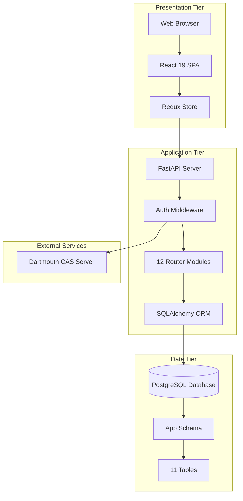

### Layer Responsibilities

| Layer | Technology | Responsibilities |
|-------|------------|------------------|
| **Presentation** | React 19, TypeScript, Redux Toolkit | UI rendering, state management, user interactions |
| **Application** | FastAPI, Python 3.12, SQLAlchemy | Business logic, API endpoints, authentication, data validation |
| **Data** | PostgreSQL 15+ | Data persistence, relationships, constraints, indexes |

---

## Component Diagram

### Detailed System Components

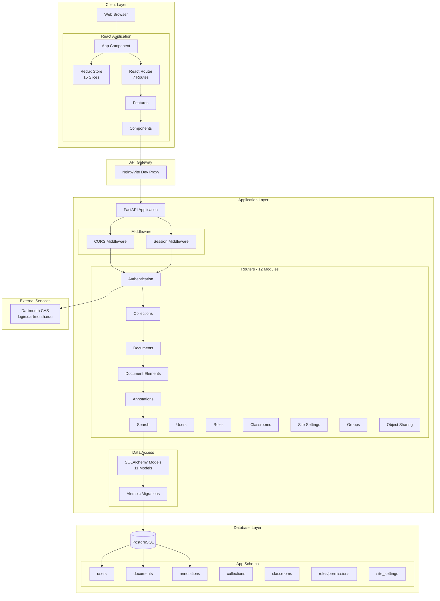

### Component Details

#### Frontend Components (React)
- **App** - Root component with providers (Redux, Auth, Router)
- **Redux Store** - 15 slices managing global state
- **Router** - 7 main routes with nested paths
- **Features** - 4 feature modules (admin, documentGallery, documentView, search)
- **Components** - Shared UI components

#### Backend Components (FastAPI)
- **FastAPI App** - ASGI application with automatic OpenAPI docs
- **Middleware** - CORS (allows all origins), Session management
- **Routers** - 12 modules handling different domains
- **Models** - 11 SQLAlchemy models
- **Migrations** - Alembic for schema versioning

#### Database Components (PostgreSQL)
- **11 Main Tables** - users, documents, annotations, collections, etc.
- **3 Association Tables** - user_roles, role_permissions, group_members
- **30+ Indexes** - B-tree, GIN for JSONB
- **7 JSONB Columns** - Flexible data storage

---

## Data Flow

### Request/Response Flow

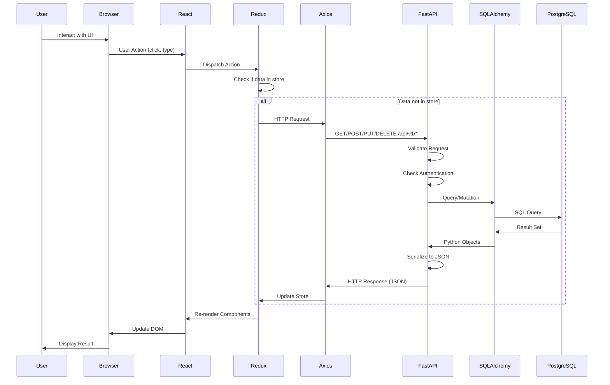

### Data Flow Patterns

#### 1. Document Loading Flow

```mermaid
graph LR
    A[User navigates to document] --> B[Router matches URL]
    B --> C[DocumentContentView component]
    C --> D[useEffect: dispatch fetchDocumentElements]
    D --> E[Redux Thunk]
    E --> F[GET /api/v1/documents/:id/elements]
    F --> G[Backend: fetch from DB]
    G --> H[Return paragraphs with formatting]
    H --> I[Redux: normalize into byId]
    I --> J[Selector: get elements for view]
    J --> K[HighlightedText components render]
    K --> L[User sees document]
```

#### 2. Annotation Creation Flow

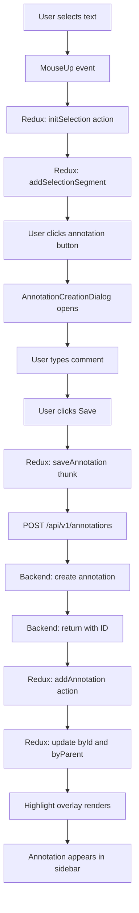

#### 3. Search Flow

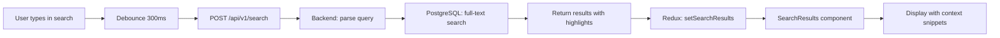

### Data Transformation Pipeline

**Frontend → Backend:**
```
TypeScript Object → JSON → Python Pydantic Schema → SQLAlchemy Model → PostgreSQL Row
```

**Backend → Frontend:**
```
PostgreSQL Row → SQLAlchemy Model → Pydantic Schema → JSON → TypeScript Object → Redux Store
```

---

## Authentication Flows

### Dual Authentication System

Genji supports **two authentication methods** that share the same session mechanism.

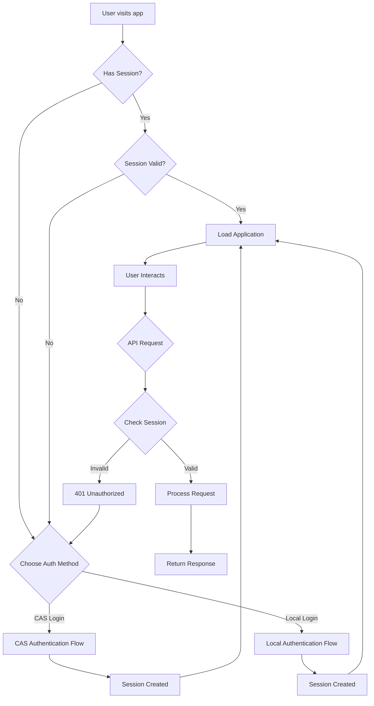

### CAS Authentication Flow (Dartmouth SSO)

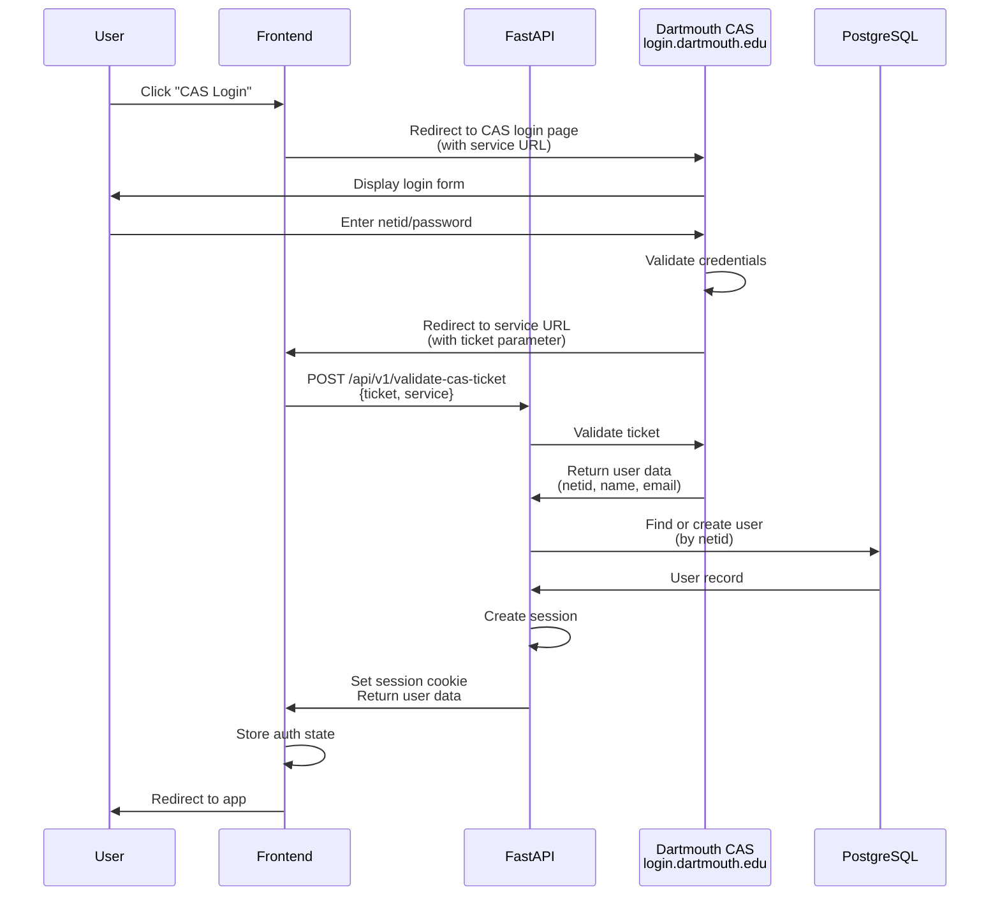

**Key Points:**
- **Redirect-based flow** - User leaves app, returns with ticket
- **Ticket validation** - Backend validates with CAS server
- **User creation** - Auto-creates user record if first login
- **Session cookie** - HTTPOnly cookie with 1-week TTL

### Local Password Authentication Flow

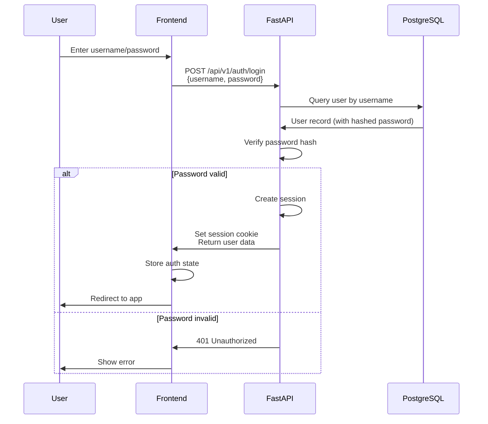

**Key Points:**
- **Password hashing** - Bcrypt with salt
- **Same session mechanism** - Uses same cookie as CAS
- **Registration** - POST /api/v1/auth/register creates account

### Session Management

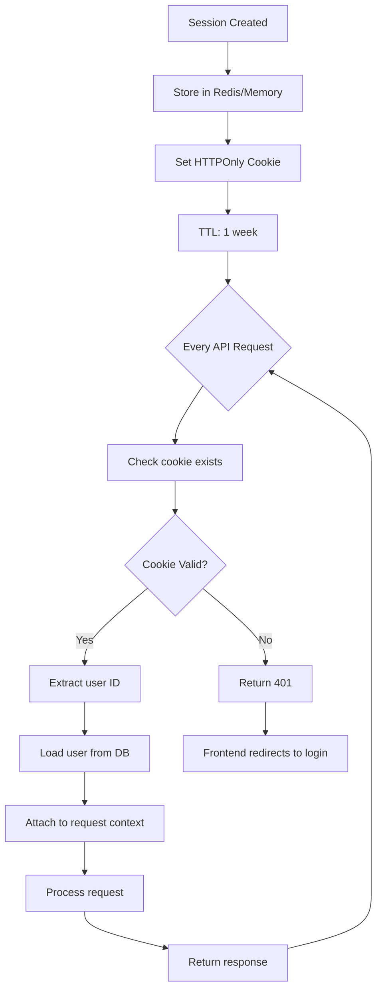

**Session Data:**
```python
{
  "user_id": 123,
  "netid": "f002abc",  # CAS users
  "username": "jdoe",  # Local users
  "roles": ["student"],
  "groups": [5, 12],
  "created_at": "2025-10-22T10:00:00Z",
  "expires_at": "2025-10-29T10:00:00Z"
}
```

### Authorization Flow

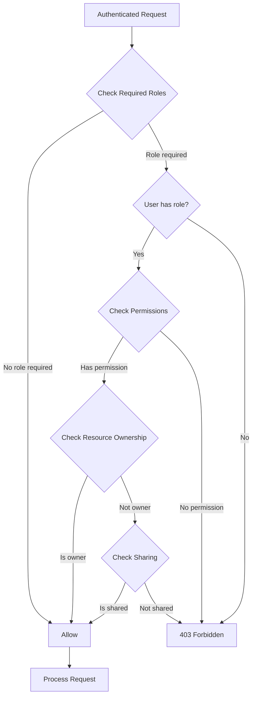

**Role Hierarchy:**
- **Admin** - Full system access
- **Instructor** - Manage classrooms, view student work
- **Student** - View shared content, create annotations
- **Public** - View public collections only

---

## Annotation Lifecycle

### Complete Annotation Workflow

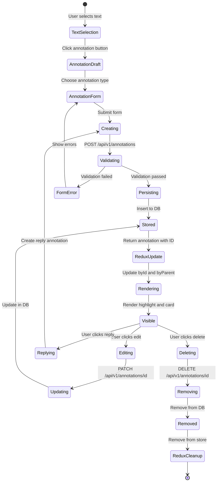

### Annotation Data Flow

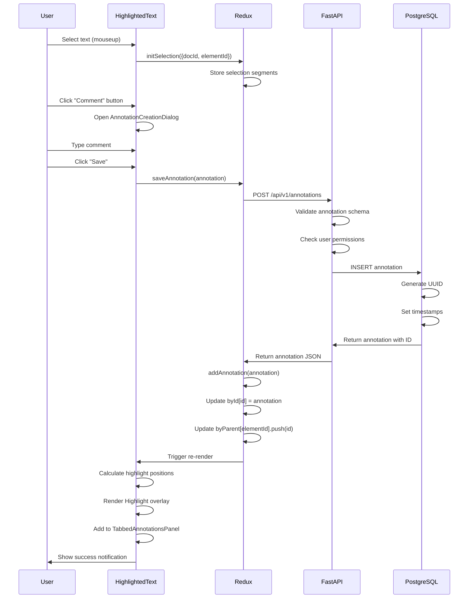

### Annotation Types & Motivations

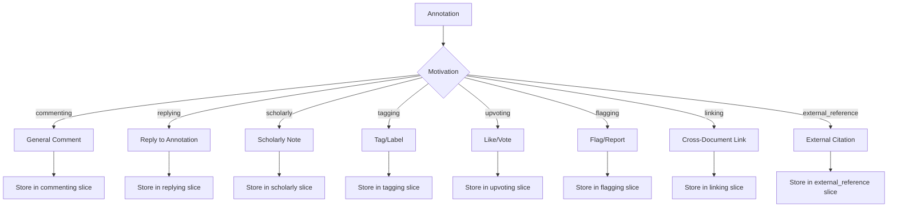

---

## Deployment Architecture

### Container Architecture (Docker Compose)

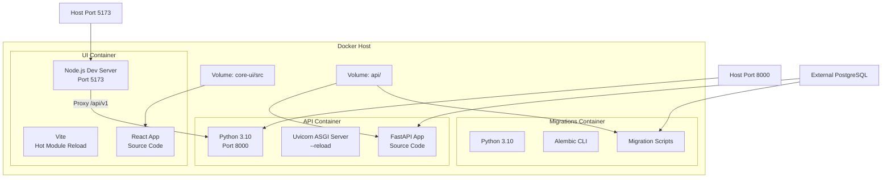

### Docker Compose Services

**File:** `docker-compose.yml`

```yaml
services:
  ui:                          # Frontend development server
    build:
      context: ./core-ui
      dockerfile: Dockerfile.dev
    ports:
      - "5173:5173"           # Vite dev server
    volumes:
      - ./core-ui/src:/app/src           # Hot reload
      - ./core-ui/vite.config.ts:/app/vite.config.ts

  api:                         # Backend API server
    build:
      context: ./api
      dockerfile: Dockerfile
    ports:
      - "8000:8000"           # FastAPI server
    volumes:
      - ./api:/app            # Hot reload

  migrations:                  # Database migration tool
    build:
      context: ./api
      dockerfile: Dockerfile.migrations
    volumes:
      - ./api:/app
```

### Production Architecture (Nginx)

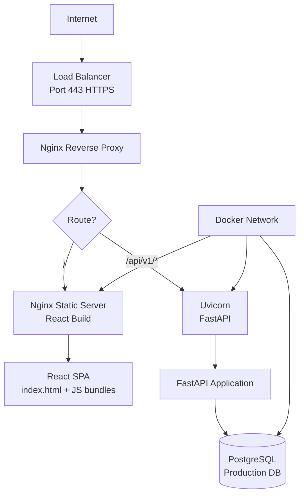

**Production Dockerfile** (`core-ui/Dockerfile`):
```dockerfile
FROM node:lts-alpine as build
WORKDIR /app
COPY package*.json ./
RUN npm install
COPY . .
RUN npm run build              # Vite build

FROM nginx:alpine
COPY --from=build /app/dist /usr/share/nginx/html
COPY nginx.conf /etc/nginx/conf.d/default.conf
EXPOSE 80
```

### Environment Configuration

**Development:**
- UI: Vite dev server with HMR
- API: Uvicorn with --reload
- DB: Local PostgreSQL or Docker PostgreSQL
- Proxy: Vite proxies `/api/v1` to `http://api:8000`

**Production:**
- UI: Nginx serving static files
- API: Uvicorn (multiple workers)
- DB: Managed PostgreSQL (AWS RDS, etc.)
- Proxy: Nginx reverse proxy

---

## Network Architecture

### Development Network Flow

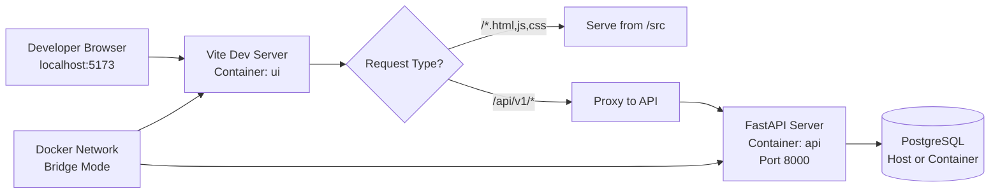

### Production Network Flow

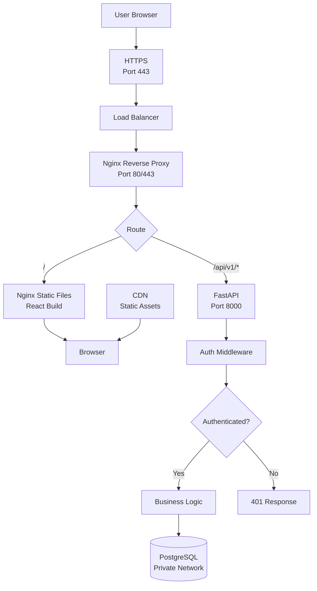

### Port Mapping

| Service | Internal Port | External Port | Purpose |
|---------|---------------|---------------|---------|
| UI (Dev) | 5173 | 5173 | Vite dev server |
| UI (Prod) | 80 | 80/443 | Nginx static server |
| API | 8000 | 8000 | FastAPI ASGI server |
| PostgreSQL | 5432 | - | Database (internal only) |

---

## Data Flow Mapping

This section provides detailed mappings of how data flows from frontend components through Redux thunks to backend endpoints and back into the Redux store.

### Document Collection Flow

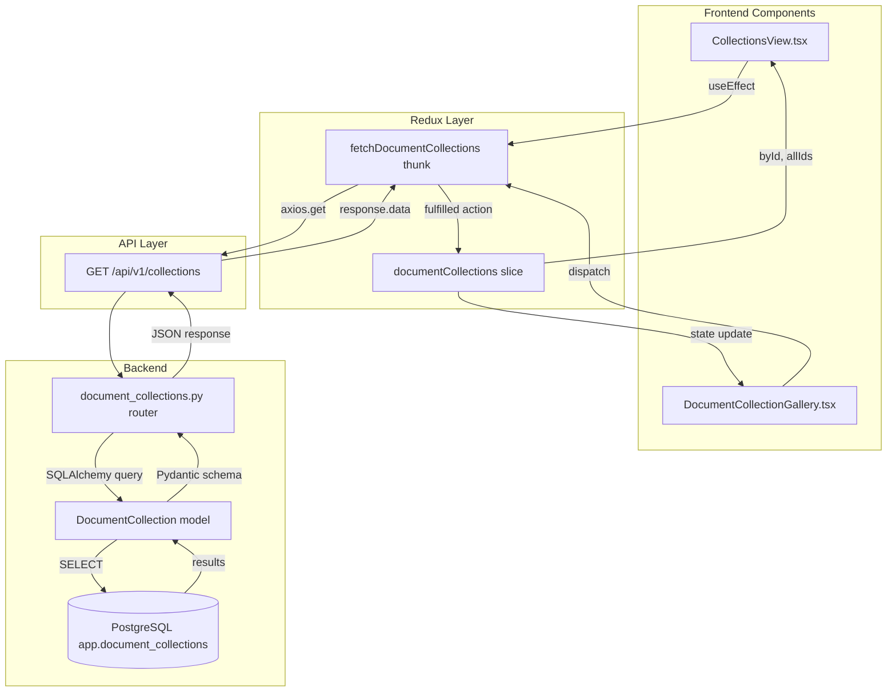

### Document Loading Flow

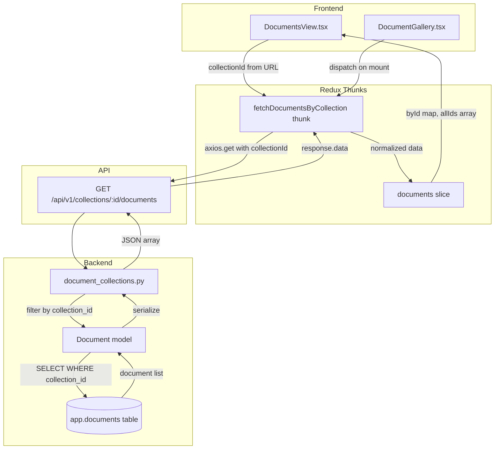

### Document Elements Flow

```mermaid
sequenceDiagram
    participant DCV as DocumentContentView.tsx
    participant Hook as useVisibilityWithPrefetch
    participant Thunk as fetchDocumentElements
    participant Slice as documentElements slice
    participant API as GET /api/v1/documents/:id/elements
    participant Router as document_elements.py
    participant DB as PostgreSQL
    
    DCV->>Hook: documentId from URL
    Hook->>Hook: Calculate visible paragraphs
    Hook->>Thunk: dispatch(fetchDocumentElements)
    Thunk->>API: GET /documents/123/elements
    API->>Router: Route to handler
    Router->>DB: SELECT * FROM app.document_elements WHERE document_id=123
    DB->>Router: Return elements array
    Router->>API: JSON response with elements
    API->>Thunk: response.data
    Thunk->>Slice: Add to byId map
    Slice->>DCV: Updated state
    DCV->>DCV: Render HighlightedText components
```

### Annotation Creation Flow

```mermaid
graph TB
    subgraph "UI Components"
        A[HighlightedText.tsx]
        B[AnnotationCreationDialog.tsx]
    end
    
    subgraph "Redux"
        C[createAnnotation slice]
        D[saveAnnotation thunk]
        E[annotations.commenting slice]
    end
    
    subgraph "API"
        F[POST /api/v1/annotations]
    end
    
    subgraph "Backend"
        G[annotations.py router]
        H[Annotation model]
        I[(app.annotations table)]
    end
    
    A -->|Text selection| C
    C -->|Store target segments| C
    B -->|User submits form| D
    D -->|POST annotation payload| F
    F --> G
    G -->|Validate motivation| G
    G -->|Create Annotation| H
    H -->|INSERT| I
    I -->|Generated UUID, timestamps| H
    H -->|Return with creator| G
    G -->|JSON response| F
    F -->|response.data| D
    D -->|Add to byId| E
    D -->|Add ID to byParent| E
    E -->|Update store| A
    A -->|Render Highlight| A
```

### Annotation Fetching by Motivation Flow

```mermaid
sequenceDiagram
    participant TAP as TabbedAnnotationsPanel.tsx
    participant Tab as AnnotationsList component
    participant Thunk as fetchAnnotationByMotivation
    participant API as GET /api/v1/annotations
    participant Router as annotations.py
    participant DB as PostgreSQL
    participant Slice as annotations.commenting slice
    
    TAP->>Tab: Render tab for "commenting"
    Tab->>Tab: useEffect with elementId
    Tab->>Thunk: dispatch(fetch motivation=commenting)
    Thunk->>API: GET /annotations?document_element_id=456&motivation=commenting
    API->>Router: Route handler
    Router->>DB: SELECT WHERE document_element_id=456 AND motivation=commenting
    DB->>Router: Annotation records
    Router->>Router: Join with users table for creator
    Router->>API: JSON array with full annotation objects
    API->>Thunk: response.data
    Thunk->>Slice: byId[annotationId] = annotation
    Thunk->>Slice: byParent[elementId].push(annotationId)
    Slice->>Tab: State updated
    Tab->>Tab: Render AnnotationCard for each
```

### Admin Document Upload Flow

```mermaid
graph TB
    subgraph "Admin UI"
        A[ManageDocuments.tsx]
        B[File Upload Form]
    end
    
    subgraph "Redux/Direct API"
        C[axios.post multipart/form-data]
    end
    
    subgraph "API"
        D[POST /api/v1/documents]
    end
    
    subgraph "Backend Processing"
        E[documents.py router]
        F[python-docx parser]
        G[Document model]
        H[DocumentElement model]
        I[(app.documents table)]
        J[(app.document_elements table)]
    end
    
    A -->|User selects .docx file| B
    B -->|FormData with file| C
    C -->|Upload file| D
    D --> E
    E -->|Save to uploads/| E
    E -->|Parse with python-docx| F
    F -->|Extract paragraphs| F
    F -->|Create Document record| G
    G -->|INSERT| I
    I -->|Return document_id| G
    G -->|Create element per paragraph| H
    H -->|INSERT batch| J
    J -->|Confirm inserts| H
    H -->|Return document with elements| E
    E -->|JSON response| D
    D -->|Document created| C
    C -->|Refresh document list| A
```

### Search Flow

```mermaid
sequenceDiagram
    participant SB as SearchBar.tsx
    participant Thunk as performSearch thunk
    participant Slice as searchResults slice
    participant API as POST /api/v1/search
    participant Router as search.py
    participant DB as PostgreSQL full-text search
    
    SB->>SB: User types query (debounced)
    SB->>Thunk: dispatch(performSearch query, filters)
    Thunk->>Slice: Set loading=true
    Thunk->>API: POST with query params
    API->>Router: search endpoint
    Router->>DB: to_tsquery on document_elements.content
    DB->>DB: Full-text search with ranking
    DB->>Router: Matching elements with ts_rank
    Router->>Router: Join with documents, collections
    Router->>API: JSON results with highlights
    API->>Thunk: response.data
    Thunk->>Slice: results array, loading=false
    Slice->>SB: Trigger re-render
    SB->>SB: Display SearchResults component
```

### User Management Flow

```mermaid
graph LR
    subgraph "Admin Component"
        A[ManageUsers.tsx]
    end
    
    subgraph "Redux"
        B[fetchUsers thunk]
        C[users slice]
    end
    
    subgraph "API"
        D[GET /api/v1/users]
    end
    
    subgraph "Backend"
        E[users.py router]
        F[User model]
        G[(app.users table)]
    end
    
    A -->|Component mount| B
    B -->|axios.get| D
    D --> E
    E -->|Admin check| E
    E -->|Query users| F
    F -->|SELECT with roles| G
    G -->|User records| F
    F -->|Serialize safely| E
    E -->|JSON array| D
    D -->|response.data| B
    B -->|Normalized data| C
    C -->|byId, allIds| A
```

### Complete Data Flow Reference Table

#### Part 1: Frontend to Backend Routing

| Feature | Component File | Redux Thunk | HTTP Method | API Endpoint |
|---------|---------------|-------------|-------------|--------------|
| **Collections** |
| List collections | `CollectionsView.tsx` | `fetchDocumentCollections` | GET | `/api/v1/collections` |
| **Documents** |
| List documents | `DocumentsView.tsx` | `fetchDocumentsByCollection` | GET | `/api/v1/collections/:id/documents` |
| Upload document | `ManageDocuments.tsx` | Direct axios | POST | `/api/v1/documents` |
| Delete document | `ManageDocuments.tsx` | Direct axios | DELETE | `/api/v1/documents/:id` |
| **Document Elements** |
| Load paragraphs | `DocumentContentView.tsx` | `fetchDocumentElements` | GET | `/api/v1/documents/:id/elements` |
| Bulk load | `DocumentGallery.tsx` | `fetchAllDocumentElements` | GET | `/api/v1/documents/:id/elements` |
| **Annotations** |
| Create comment | `AnnotationCreationDialog.tsx` | `saveAnnotation` | POST | `/api/v1/annotations` |
| Fetch comments | `TabbedAnnotationsPanel.tsx` | `fetchAnnotationByMotivation` | GET | `/api/v1/annotations?motivation=commenting` |
| Update annotation | `AnnotationCard.tsx` | `patchAnnotation` | PATCH | `/api/v1/annotations/:id` |
| Delete annotation | `AnnotationCard.tsx` | `deleteAnnotation` | DELETE | `/api/v1/annotations/:id` |
| Reply to comment | `AnnotationReplyForm.tsx` | `saveAnnotation` | POST | `/api/v1/annotations` |
| **Search** |
| Search content | `SearchBar.tsx` | `performSearch` | POST | `/api/v1/search` |
| **Users & Auth** |
| List users | `ManageUsers.tsx` | `fetchUsers` | GET | `/api/v1/users` |
| Login | `LoginForm.tsx` | Direct axios | POST | `/api/v1/auth/login` |
| Register | `RegisterForm.tsx` | Direct axios | POST | `/api/v1/auth/register` |
| CAS login | `useAuth.ts` hook | `useCasAuth` | POST | `/api/v1/validate-cas-ticket` |
| **Classrooms** |
| List classrooms | `ManageClassrooms.tsx` | `fetchClassrooms` | GET | `/api/v1/classrooms` |
| Create classroom | `ManageClassrooms.tsx` | `createClassroom` | POST | `/api/v1/classrooms` |
| Join classroom | `JoinClassroomPage.tsx` | Direct axios | POST | `/api/v1/classrooms/:id/join` |
| List members | `ManageClassrooms.tsx` | `fetchClassroomMembers` | GET | `/api/v1/classrooms/:id/members` |
| **Roles** |
| Fetch roles | `ManageUsers.tsx` | `fetchRoles` | GET | `/api/v1/roles` |
| **Site Settings** |
| Get settings | `SiteSettings.tsx` | `fetchSiteSettings` | GET | `/api/v1/site-settings` |
| Update setting | `SiteSettings.tsx` | `updateSiteSetting` | PUT | `/api/v1/site-settings/:key` |

#### Part 2: Backend to Redux Store Mapping

| Feature | Backend Router | Redux Slice | Database Table |
|---------|----------------|-------------|----------------|
| **Collections** |
| List collections | `document_collections.py` | `documentCollections` | `app.document_collections` |
| **Documents** |
| List documents | `document_collections.py` | `documents` | `app.documents` |
| Upload document | `documents.py` | `documents` | `app.documents` |
| Delete document | `documents.py` | `documents` | `app.documents` |
| **Document Elements** |
| Load paragraphs | `document_elements.py` | `documentElements` | `app.document_elements` |
| Bulk load | `document_elements.py` | `documentElements` | `app.document_elements` |
| **Annotations** |
| Create comment | `annotations.py` | `annotations.commenting` | `app.annotations` |
| Fetch comments | `annotations.py` | `annotations.commenting` | `app.annotations` |
| Update annotation | `annotations.py` | `annotations.commenting` | `app.annotations` |
| Delete annotation | `annotations.py` | `annotations.commenting` | `app.annotations` |
| Reply to comment | `annotations.py` | `annotations.replying` | `app.annotations` |
| **Search** |
| Search content | `search.py` | `searchResults` | `app.document_elements` (full-text) |
| **Users & Auth** |
| List users | `users.py` | `users` | `app.users` |
| Login | `auth.py` | Auth context | `app.users`, `app.user_passwords` |
| Register | `auth.py` | Auth context | `app.users`, `app.user_passwords` |
| CAS login | `cas_auth.py` | Auth context | `app.users` |
| **Classrooms** |
| List classrooms | `groups.py` | `classrooms` | `app.groups` (type=classroom) |
| Create classroom | `groups.py` | `classrooms` | `app.groups` |
| Join classroom | `groups.py` | `classrooms` | `app.group_memberships` |
| List members | `groups.py` | `classrooms.members` | `app.group_memberships` |
| **Roles** |
| Fetch roles | `roles.py` | `roles` | `app.roles` |
| **Site Settings** |
| Get settings | `site_settings.py` | `siteSettings` | `app.site_settings` |
| Update setting | `site_settings.py` | `siteSettings` | `app.site_settings` |

### Key Observations

#### Data Flow Patterns

1. **Normalized State Pattern**
   - Most slices use `byId` (object) + `allIds` (array) for O(1) lookups
   - Annotations use `byId` + `byParent` for filtering by document element

2. **Thunk Usage**
   - Collections/Documents: Simple fetch thunks
   - Annotations: Parameterized by motivation type (8 variants)
   - Bulk loading: `fetchAllDocumentElements` with per-document loading callbacks

3. **Direct Axios vs Thunks**
   - Admin operations (upload, delete): Often use direct axios
   - Data fetching/listing: Always use thunks
   - Authentication: Direct axios (pre-Redux setup)

4. **Backend Router Organization**
   - 1 router file per resource type
   - RESTful patterns (GET list, GET by ID, POST, PATCH, DELETE)
   - Nested routes for relationships (e.g., `/collections/:id/documents`)

5. **Database Joins**
   - Annotations JOIN users for creator info
   - Documents JOIN collections for collection metadata
   - Search results JOIN multiple tables for context

---

## Integration Points

### Frontend ↔ Backend Integration


```mermaid
graph LR
    A[React Component] --> B[Redux Action/Thunk]
    B --> C[Axios HTTP Client]
    C --> D[API v1 endpoint]
    
    D --> E[FastAPI Router]
    E --> F[Pydantic Validation]
    F --> G{Valid?}
    
    G -->|Yes| H[Business Logic]
    G -->|No| I[422 Validation Error]
    
    H --> J[SQLAlchemy Query]
    J --> K[(PostgreSQL)]
    K --> J
    
    J --> L[Pydantic Schema]
    L --> M[JSON Response]
    
    M --> C
    I --> C
    
    C --> N[Redux Store Update]
    N --> O[Component Re-render]
```

### API Contract

**Request Format:**
```typescript
// Frontend (TypeScript)
interface AnnotationCreate {
  document_collection_id: number;
  document_id: number;
  document_element_id: number;
  motivation: string;
  body: {
    type: string;
    value: string;
    format: string;
  };
  target: Array<{
    source: string;
    selector?: {...};
  }>;
}

// POST /api/v1/annotations
axios.post('/api/v1/annotations', annotation);
```

**Response Format:**
```python
# Backend (Python)
class AnnotationResponse(BaseModel):
    id: str                    # UUID
    created: datetime
    modified: datetime
    creator: UserPublic
    motivation: str
    body: AnnotationBody
    target: List[AnnotationTarget]
    # ...other fields

# Returns JSON
return JSONResponse(content=annotation.model_dump())
```

### External Integrations

```mermaid
graph TB
    A[Genji System] --> B{External Services}
    
    B --> C[Dartmouth CAS<br/>login.dartmouth.edu]
    B --> D[Email Server<br/>SMTP]
    B --> E[File Storage<br/>Local/S3]
    
    C --> F[CAS Ticket Validation<br/>/serviceValidate]
    C --> G[CAS Login Page<br/>/login]
    C --> H[CAS Logout<br/>/logout]
    
    D --> I[User Notifications]
    D --> J[Password Reset]
    
    E --> K[Document Storage<br/>Word, PDF files]
    E --> L[User Uploads]
```

---

## Scalability Considerations

### Current Architecture Limitations

1. **Stateful Sessions** - Sessions stored in-memory (single server)
2. **Single Database** - No read replicas
3. **No Caching** - Direct database queries for all reads
4. **File Storage** - Local filesystem (not distributed)

### Scalability Roadmap

```mermaid
graph TB
    subgraph "Phase 1: Current"
        A1[Single API Server]
        A2[Local Sessions]
        A3[Single PostgreSQL]
        A4[Local File Storage]
    end
    
    subgraph "Phase 2: Horizontal Scaling"
        B1[Multiple API Servers]
        B2[Redis Session Store]
        B3[PostgreSQL Primary]
        B4[S3 File Storage]
        B5[Load Balancer]
    end
    
    subgraph "Phase 3: High Availability"
        C1[Auto-scaling API Servers]
        C2[Redis Cluster]
        C3[PostgreSQL Primary + Read Replicas]
        C4[CDN for Static Assets]
        C5[Application Load Balancer]
        C6[Database Connection Pool]
    end
    
    subgraph "Phase 4: Advanced"
        D1[Kubernetes Orchestration]
        D2[Redis Cluster + Backup]
        D3[PostgreSQL Cluster<br/>Multi-AZ]
        D4[ElasticSearch for Search]
        D5[Microservices<br/>Auth, Annotations, Search]
        D6[Message Queue<br/>Async Processing]
    end
```

### Performance Optimizations

**Database Level:**
- Add read replicas for GET requests
- Implement connection pooling
- Add Redis cache for frequently accessed data
- Optimize indexes based on query patterns

**Application Level:**
- Implement API response caching
- Use background jobs for document processing
- Batch database queries
- Implement rate limiting

**Frontend Level:**
- Code splitting for large components
- Lazy loading for routes
- Virtual scrolling for long lists
- Service worker for offline support

---

## Related Documentation

- **[Frontend Overview](../frontend/OVERVIEW.md)** - React architecture
- **[API Overview](../api/OVERVIEW.md)** - Backend architecture
- **[Database Schema](../database/SCHEMA.md)** - Database design
- **[Deployment Guide](../guides/DEPLOYMENT.md)** - Production deployment

---

**Document Version:** 1.0  
**Last Updated:** October 22, 2025  
**Maintainers:** Dartmouth ITC Genji Team
