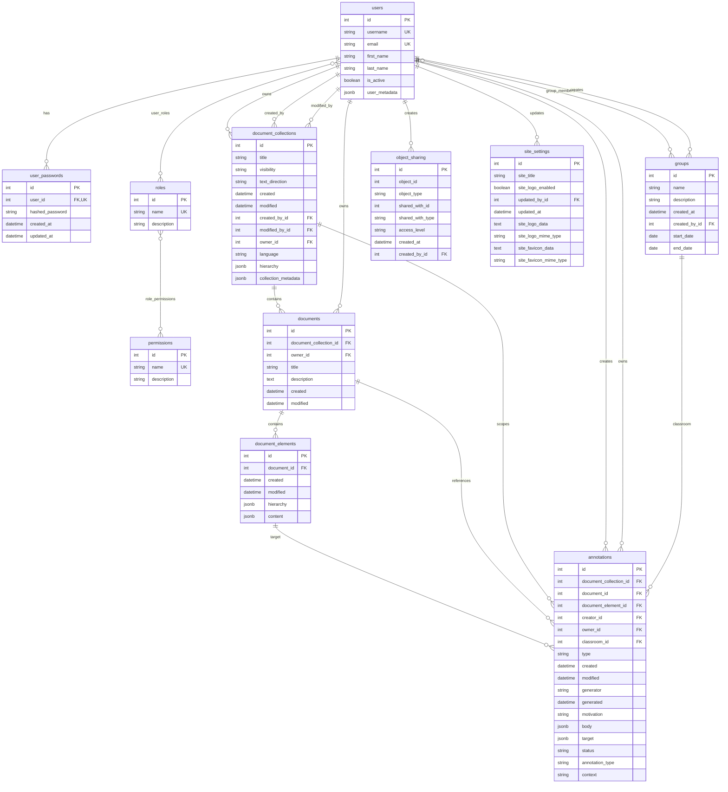
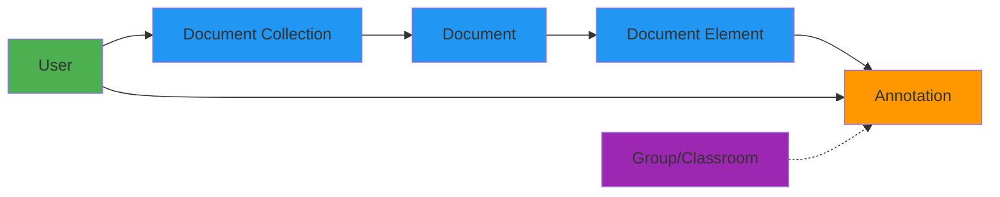
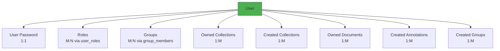
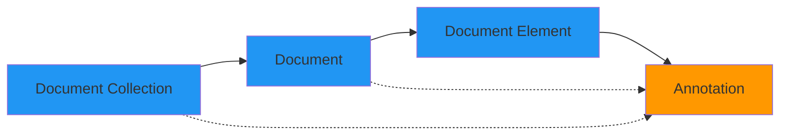

# Database Schema Documentation

**Project**: Genji Document Annotation Platform  
**Database**: PostgreSQL 15+  
**ORM**: SQLAlchemy 2.0  
**Schema**: `app`  
**Last Updated**: October 22, 2025

---

## Table of Contents

1. [Schema Overview](#schema-overview)
2. [Entity Relationship Diagram](#entity-relationship-diagram)
3. [Tables Reference](#tables-reference)
4. [Association Tables](#association-tables)
5. [Relationships](#relationships)
6. [Indexes](#indexes)
7. [JSONB Fields](#jsonb-fields)
8. [Sequences](#sequences)
9. [Constraints](#constraints)
10. [Migration Guide](#migration-guide)

---

## Schema Overview

The Genji database uses a **single PostgreSQL schema** named `app` to organize all tables. This approach provides namespace isolation while keeping the structure simple.

### Database Statistics

| Metric | Count |
|--------|-------|
| **Tables** | 11 |
| **Association Tables** | 3 |
| **Total Entities** | 14 |
| **Foreign Keys** | 18+ |
| **Indexes** | 30+ |
| **JSONB Columns** | 7 |
| **Sequences** | 2 |

### Table Categories

**User Management (4 tables)**:
- `users` - User accounts
- `user_passwords` - Password storage
- `roles` - User roles
- `permissions` - Permission definitions

**Content Management (4 tables)**:
- `document_collections` - Collections of documents
- `documents` - Individual documents
- `document_elements` - Granular content units
- `annotations` - User annotations

**Collaboration (2 tables)**:
- `groups` - Classrooms/teams
- `object_sharing` - Sharing permissions

**Configuration (1 table)**:
- `site_settings` - Platform configuration

**Association Tables (3)**:
- `user_roles` - User-role mapping
- `role_permissions` - Role-permission mapping
- `group_members` - Group membership

---

## Entity Relationship Diagram

### Complete Schema



### Core Data Flow



---

## Tables Reference

### 1. users

**Purpose**: Store user account information

| Column | Type | Constraints | Description |
|--------|------|-------------|-------------|
| `id` | INTEGER | PK, AUTO | User ID |
| `first_name` | VARCHAR(255) | | User's first name |
| `last_name` | VARCHAR(255) | | User's last name |
| `email` | VARCHAR(255) | UNIQUE, INDEX | Email address |
| `username` | VARCHAR(255) | UNIQUE, INDEX | Username for login |
| `is_active` | BOOLEAN | DEFAULT TRUE | Account status |
| `user_metadata` | JSONB | | Additional user data |

**Indexes**:
- `idx_users_metadata` (GIN) - For JSONB queries

**Relationships**:
- Has one `user_passwords` (1:1)
- Has many `document_collections` (owner, creator, modifier)
- Has many `documents` (owner)
- Has many `annotations` (creator, owner)
- Has many `groups` (creator, member)
- Belongs to many `roles` (via user_roles)
- Belongs to many `groups` (via group_members)

**Notes**:
- Email and username must be unique
- Soft delete via `is_active` flag
- No password stored here (see user_passwords)

---

### 2. user_passwords

**Purpose**: Securely store user passwords

| Column | Type | Constraints | Description |
|--------|------|-------------|-------------|
| `id` | INTEGER | PK, AUTO | Password record ID |
| `user_id` | INTEGER | FK, UNIQUE | User reference |
| `hashed_password` | VARCHAR(255) | NOT NULL | Bcrypt hashed password |
| `created_at` | TIMESTAMP | DEFAULT NOW | Password creation time |
| `updated_at` | TIMESTAMP | AUTO UPDATE | Last password change |

**Indexes**:
- `idx_user_passwords_user_id` - Foreign key index

**Relationships**:
- Belongs to `users` (1:1)

**Security Notes**:
- Passwords hashed with bcrypt (cost factor 12)
- `updated_at` tracks password changes
- One password per user (1:1 relationship)
- Users with CAS auth have no password record

---

### 3. roles

**Purpose**: Define user roles (admin, instructor, student)

| Column | Type | Constraints | Description |
|--------|------|-------------|-------------|
| `id` | INTEGER | PK, AUTO | Role ID |
| `name` | VARCHAR(50) | UNIQUE | Role name |
| `description` | VARCHAR(255) | | Role description |

**Relationships**:
- Belongs to many `users` (via user_roles)
- Has many `permissions` (via role_permissions)

**Typical Roles**:
```sql
-- Common role setup
INSERT INTO app.roles (name, description) VALUES
  ('admin', 'Full system access'),
  ('instructor', 'Classroom and content management'),
  ('student', 'Document viewing and annotation');
```

---

### 4. permissions

**Purpose**: Define granular permissions

| Column | Type | Constraints | Description |
|--------|------|-------------|-------------|
| `id` | INTEGER | PK, AUTO | Permission ID |
| `name` | VARCHAR(100) | UNIQUE | Permission name |
| `description` | VARCHAR(255) | | Permission description |

**Relationships**:
- Belongs to many `roles` (via role_permissions)

---

### 5. groups

**Purpose**: Organize users into classrooms or teams

| Column | Type | Constraints | Description |
|--------|------|-------------|-------------|
| `id` | INTEGER | PK, AUTO | Group ID |
| `name` | VARCHAR(100) | | Group name |
| `description` | VARCHAR(255) | | Group description |
| `created_at` | TIMESTAMP | DEFAULT NOW | Creation timestamp |
| `created_by_id` | INTEGER | FK | Creator user ID |
| `start_date` | DATE | NULLABLE | Group start date (e.g., semester start) |
| `end_date` | DATE | NULLABLE | Group end date (e.g., semester end) |

**Indexes**:
- Foreign key indexes on `created_by_id`

**Relationships**:
- Belongs to `users` (creator)
- Has many `users` (via group_members)
- Has many `annotations` (classroom context)

**Notes**:
- `start_date` and `end_date` currently nullable (TODO: make required)
- Used for semester-based classroom organization
- Enables instructor oversight of student annotations

---

### 6. object_sharing

**Purpose**: Manage sharing permissions for documents and collections

| Column | Type | Constraints | Description |
|--------|------|-------------|-------------|
| `id` | INTEGER | PK, AUTO | Sharing record ID |
| `object_id` | INTEGER | INDEX | ID of shared object |
| `object_type` | VARCHAR(50) | INDEX | Type (document, collection) |
| `shared_with_id` | INTEGER | INDEX | User or group ID |
| `shared_with_type` | VARCHAR(10) | | 'user' or 'group' |
| `access_level` | VARCHAR(20) | | 'view', 'edit', 'manage' |
| `created_at` | TIMESTAMP | DEFAULT NOW | Share creation time |
| `created_by_id` | INTEGER | FK | Creator user ID |

**Indexes**:
- `idx_object_sharing_object` - Composite (object_id, object_type)
- `idx_object_sharing_shared_with` - Composite (shared_with_id, shared_with_type)

**Relationships**:
- Belongs to `users` (creator)

**Status**: ⚠️ **Defined but no API endpoints yet**

**Access Levels**:
- `view` - Read-only access
- `edit` - Can modify content
- `manage` - Can share with others

**Example**:
```sql
-- Share collection 5 with group 10 (view access)
INSERT INTO app.object_sharing 
  (object_id, object_type, shared_with_id, shared_with_type, access_level, created_by_id)
VALUES 
  (5, 'collection', 10, 'group', 'view', 1);
```

---

### 7. document_collections

**Purpose**: Container for related documents

| Column | Type | Constraints | Description |
|--------|------|-------------|-------------|
| `id` | INTEGER | PK, AUTO | Collection ID |
| `title` | VARCHAR(255) | | Collection title |
| `visibility` | VARCHAR(50) | | public, private, shared |
| `text_direction` | VARCHAR(50) | | ltr, rtl |
| `created` | TIMESTAMP | DEFAULT NOW | Creation time |
| `modified` | TIMESTAMP | AUTO UPDATE | Last modification |
| `created_by_id` | INTEGER | FK | Creator user ID |
| `modified_by_id` | INTEGER | FK | Last modifier user ID |
| `owner_id` | INTEGER | FK | Owner user ID |
| `language` | VARCHAR(50) | | Language code (en, es, etc.) |
| `hierarchy` | JSONB | | Hierarchical structure definition |
| `collection_metadata` | JSONB | | Additional metadata |

**Indexes**:
- `idx_document_collections_created_by`
- `idx_document_collections_modified_by`
- `idx_document_collections_owner`
- `idx_document_collections_hierarchy` (GIN)
- `idx_document_collections_metadata` (GIN)

**Relationships**:
- Belongs to `users` (owner, creator, modifier)
- Has many `documents`
- Has many `annotations`

**JSONB Examples**:

**hierarchy**:
```json
{
  "type": "book",
  "levels": ["chapter", "section", "paragraph"],
  "chapter_count": 10
}
```

**collection_metadata**:
```json
{
  "author": "F. Scott Fitzgerald",
  "year": 1925,
  "genre": "Novel",
  "tags": ["american-literature", "1920s", "classic"]
}
```

---

### 8. documents

**Purpose**: Individual documents within a collection

| Column | Type | Constraints | Description |
|--------|------|-------------|-------------|
| `id` | INTEGER | PK, AUTO | Document ID |
| `document_collection_id` | INTEGER | FK | Parent collection |
| `owner_id` | INTEGER | FK | Owner user ID |
| `title` | VARCHAR(255) | | Document title |
| `description` | TEXT | | Document description |
| `created` | TIMESTAMP | DEFAULT NOW | Creation time |
| `modified` | TIMESTAMP | AUTO UPDATE | Last modification |

**Indexes**:
- `idx_documents_collection_id`
- `idx_documents_owner`

**Relationships**:
- Belongs to `document_collections`
- Belongs to `users` (owner)
- Has many `document_elements`
- Has many `annotations`

**Notes**:
- Documents must belong to exactly one collection
- Actual content stored in document_elements

---

### 9. document_elements

**Purpose**: Granular content units (paragraphs, sections, etc.)

| Column | Type | Constraints | Description |
|--------|------|-------------|-------------|
| `id` | INTEGER | PK, AUTO | Element ID |
| `document_id` | INTEGER | FK | Parent document |
| `created` | TIMESTAMP | DEFAULT NOW | Creation time |
| `modified` | TIMESTAMP | AUTO UPDATE | Last modification |
| `hierarchy` | JSONB | | Position in document |
| `content` | JSONB | | Text and formatting |

**Indexes**:
- `idx_document_elements_document_id`
- `idx_document_elements_hierarchy` (GIN)
- `idx_document_elements_content` (GIN)

**Relationships**:
- Belongs to `documents`
- Has many `annotations`

**JSONB Structure**:

**hierarchy**:
```json
{
  "chapter": 1,
  "section": 2,
  "paragraph": 5,
  "element_order": 15
}
```

**content**:
```json
{
  "text": "In my younger and more vulnerable years...",
  "formatting": {
    "alignment": "left",
    "indent": 0,
    "text_styles": {
      "is_bold": false,
      "is_italic": false,
      "formatting": [
        {
          "start": 10,
          "end": 20,
          "type": ["italic"]
        }
      ]
    }
  }
}
```

---

### 10. annotations

**Purpose**: User-generated content attached to document elements

| Column | Type | Constraints | Description |
|--------|------|-------------|-------------|
| `id` | INTEGER | PK, AUTO | Annotation ID |
| `document_collection_id` | INTEGER | FK | Collection reference |
| `document_id` | INTEGER | FK | Document reference |
| `document_element_id` | INTEGER | FK | Element reference |
| `creator_id` | INTEGER | FK | Creator user ID |
| `owner_id` | INTEGER | FK | Owner user ID |
| `classroom_id` | INTEGER | FK, NULL | Classroom scope |
| `type` | VARCHAR(100) | | Annotation type |
| `created` | TIMESTAMP | | Creation time |
| `modified` | TIMESTAMP | | Last modification |
| `generator` | VARCHAR(255) | | Generating application |
| `generated` | TIMESTAMP | | Generation timestamp |
| `motivation` | VARCHAR(100) | INDEX | Purpose (commenting, tagging, etc.) |
| `body` | JSONB | | Annotation content |
| `target` | JSONB | | Target specification |
| `status` | VARCHAR(50) | | Status (active, deleted, etc.) |
| `annotation_type` | VARCHAR(100) | | Additional type info |
| `context` | VARCHAR(255) | | Contextual information |

**Indexes**:
- `idx_annotations_document_id`
- `idx_annotations_document_element_id`
- `idx_annotations_creator_id`
- `idx_annotations_owner_id`
- `idx_annotations_collection_id`
- `idx_annotations_classroom_id`
- `idx_annotations_type`
- `idx_annotations_created`
- `idx_annotations_motivation`
- `idx_annotations_body` (GIN)
- `idx_annotations_target` (GIN)

**Relationships**:
- Belongs to `document_collections`
- Belongs to `documents`
- Belongs to `document_elements`
- Belongs to `users` (creator, owner)
- Belongs to `groups` (classroom)

**Motivation Values**:
- `commenting` - User comments
- `highlighting` - Text highlights
- `tagging` - Content tags
- `questioning` - Questions
- `replying` - Responses
- `linking` - Cross-references

**JSONB Examples**:

**body** (comment):
```json
{
  "type": "TextualBody",
  "value": "This passage demonstrates the theme of the American Dream.",
  "format": "text/plain",
  "language": "en"
}
```

**body** (tag):
```json
{
  "type": "TextualBody",
  "value": "symbolism",
  "purpose": "tagging"
}
```

**target**:
```json
{
  "source": "document_element:42",
  "selector": {
    "type": "TextQuoteSelector",
    "exact": "the green light",
    "prefix": "Gatsby believed in ",
    "suffix": ", the orgastic future"
  }
}
```

---

### 11. site_settings

**Purpose**: Platform configuration (singleton table)

| Column | Type | Constraints | Description |
|--------|------|-------------|-------------|
| `id` | INTEGER | PK, AUTO | Settings ID |
| `site_title` | VARCHAR(50) | NOT NULL | Site title |
| `site_logo_enabled` | BOOLEAN | DEFAULT FALSE | Show logo flag |
| `updated_by_id` | INTEGER | FK, NOT NULL | Last updater user ID |
| `updated_at` | TIMESTAMP | AUTO UPDATE | Last update time |
| `site_logo_data` | TEXT | NULL | Base64 logo data |
| `site_logo_mime_type` | VARCHAR(50) | NULL | Logo MIME type |
| `site_favicon_data` | TEXT | NULL | Base64 favicon data |
| `site_favicon_mime_type` | VARCHAR(50) | NULL | Favicon MIME type |

**Indexes**:
- `idx_site_settings_updated_by`

**Relationships**:
- Belongs to `users` (updated_by)

**Notes**:
- Typically only one row exists (singleton pattern)
- Images stored as base64-encoded text
- Updated via admin panel

---

## Association Tables

### user_roles

**Purpose**: Many-to-many relationship between users and roles

| Column | Type | Constraints |
|--------|------|-------------|
| `user_id` | INTEGER | FK → users.id |
| `role_id` | INTEGER | FK → roles.id |

**Composite Primary Key**: (user_id, role_id)

**Example**:
```sql
-- Assign admin role to user 1
INSERT INTO app.user_roles (user_id, role_id) VALUES (1, 1);
```

---

### role_permissions

**Purpose**: Many-to-many relationship between roles and permissions

| Column | Type | Constraints |
|--------|------|-------------|
| `role_id` | INTEGER | FK → roles.id |
| `permission_id` | INTEGER | FK → permissions.id |

**Composite Primary Key**: (role_id, permission_id)

---

### group_members

**Purpose**: Many-to-many relationship between users and groups

| Column | Type | Constraints |
|--------|------|-------------|
| `group_id` | INTEGER | FK → groups.id |
| `user_id` | INTEGER | FK → users.id |
| `joined_at` | TIMESTAMP | DEFAULT NOW |

**Composite Primary Key**: (group_id, user_id)

**Notes**:
- Tracks when user joined group
- Used for classroom rosters

---

## Relationships

### User Relationships



### Content Hierarchy



### Ownership Model

Every major content object has ownership tracking:

```
DocumentCollection
├── owner_id → User (who controls it)
├── created_by_id → User (who created it)
└── modified_by_id → User (who last modified it)

Document
└── owner_id → User

Annotation
├── creator_id → User (who created it)
└── owner_id → User (who owns it)
```

---

## Indexes

### Index Strategy

The database uses three types of indexes:

1. **B-tree indexes** (default) - Foreign keys, primary keys, unique constraints
2. **GIN indexes** - JSONB fields for fast containment queries
3. **Composite indexes** - Multiple columns (e.g., object_id + object_type)

### Index Performance

| Index Type | Use Case | Example Query |
|------------|----------|---------------|
| **Foreign Key** | Join optimization | `SELECT * FROM annotations WHERE document_id = 42` |
| **GIN (JSONB)** | JSON queries | `SELECT * FROM elements WHERE content @> '{"text": "search"}'` |
| **Composite** | Multi-column filters | `SELECT * FROM object_sharing WHERE object_id = 5 AND object_type = 'collection'` |

### Critical Indexes

**Most Used**:
- `idx_annotations_document_element_id` - Annotation queries (heavily used)
- `idx_document_elements_document_id` - Element retrieval
- `idx_documents_collection_id` - Document listing

**Performance Critical**:
- `idx_annotations_body` (GIN) - Annotation search
- `idx_document_elements_content` (GIN) - Full-text search
- `idx_annotations_motivation` - Filtering by purpose

---

## JSONB Fields

### Why JSONB?

The database uses JSONB (binary JSON) for flexible, schema-less data storage:

**Advantages**:
- Flexible schema evolution
- Rich querying capabilities
- Good performance with GIN indexes
- Native JSON operators

**Fields Using JSONB**:
1. `users.user_metadata` - Extra user attributes
2. `document_collections.hierarchy` - Structure definition
3. `document_collections.collection_metadata` - Custom metadata
4. `document_elements.hierarchy` - Position tracking
5. `document_elements.content` - Text and formatting
6. `annotations.body` - Annotation content
7. `annotations.target` - Target specification

### JSONB Query Examples

**Containment** (`@>`):
```sql
-- Find elements with specific text
SELECT * FROM app.document_elements 
WHERE content @> '{"text": "American Dream"}';

-- Find annotations with specific motivation
SELECT * FROM app.annotations 
WHERE body @> '{"purpose": "tagging"}';
```

**Key Existence** (`?`):
```sql
-- Find users with metadata
SELECT * FROM app.users 
WHERE user_metadata ? 'institution';
```

**Path Extraction** (`->>`, `->>`):
```sql
-- Extract text from elements
SELECT id, content->>'text' as text 
FROM app.document_elements;

-- Extract annotation motivation
SELECT id, body->>'value' as comment_text
FROM app.annotations 
WHERE motivation = 'commenting';
```

---

## Sequences

### Custom Sequences

```sql
-- Annotation body ID sequence
CREATE SEQUENCE app.annotation_body_id_seq;

-- Annotation target ID sequence  
CREATE SEQUENCE app.annotation_target_id_seq;
```

**Purpose**: Generate unique IDs for annotation body and target objects

**Usage** (in application):
```python
body_id = db.execute(text("SELECT nextval('app.annotation_body_id_seq')")).scalar_one()
```

**Note**: These sequences are used by the application but not as table primary keys.

---

## Constraints

### Primary Keys

All tables have an `id` column as primary key (auto-incrementing integer).

### Foreign Keys

| From Table | Column | References | On Delete |
|------------|--------|------------|-----------|
| user_passwords | user_id | users.id | CASCADE |
| document_collections | owner_id | users.id | RESTRICT |
| document_collections | created_by_id | users.id | RESTRICT |
| document_collections | modified_by_id | users.id | RESTRICT |
| documents | document_collection_id | document_collections.id | CASCADE |
| documents | owner_id | users.id | RESTRICT |
| document_elements | document_id | documents.id | CASCADE |
| annotations | document_collection_id | document_collections.id | SET NULL |
| annotations | document_id | documents.id | SET NULL |
| annotations | document_element_id | document_elements.id | CASCADE |
| annotations | creator_id | users.id | RESTRICT |
| annotations | owner_id | users.id | RESTRICT |
| annotations | classroom_id | groups.id | SET NULL |
| groups | created_by_id | users.id | RESTRICT |
| object_sharing | created_by_id | users.id | RESTRICT |
| site_settings | updated_by_id | users.id | RESTRICT |

### Unique Constraints

- `users.email` - Unique email addresses
- `users.username` - Unique usernames
- `user_passwords.user_id` - One password per user
- `roles.name` - Unique role names
- `permissions.name` - Unique permission names

---

## Migration Guide

### Alembic Configuration

Migrations managed via Alembic in `api/alembic/` directory.

**Configuration** (`alembic.ini`):
```ini
[alembic]
script_location = alembic
sqlalchemy.url = postgresql://...
```

### Common Migration Commands

**Generate Migration**:
```bash
docker compose run --remove-orphans migrations revision --autogenerate -m "Description"
```

**Apply Migrations**:
```bash
docker compose run --remove-orphans migrations upgrade head
```

**Rollback**:
```bash
docker compose run --remove-orphans migrations downgrade -1
```

**Check Status**:
```bash
docker compose run --remove-orphans migrations current
docker compose run --remove-orphans migrations history
```

### Migration Best Practices

1. **Always review auto-generated migrations** - Alembic may miss complex changes
2. **Test migrations on development database first**
3. **Include both upgrade and downgrade** operations
4. **Don't modify existing migrations** - Create new ones instead
5. **Back up production database** before major migrations

### Example Migration

```python
"""Add indexes for performance

Revision ID: abc123
Revises: xyz456
Create Date: 2025-10-22 10:30:00
"""
from alembic import op
import sqlalchemy as sa

def upgrade():
    op.create_index(
        'idx_annotations_created',
        'annotations',
        ['created'],
        schema='app'
    )

def downgrade():
    op.drop_index('idx_annotations_created', schema='app')
```

---

## Database Queries - Common Patterns

### Efficient Queries

**Get annotations with user info**:
```python
from sqlalchemy.orm import joinedload

annotations = db.query(Annotation).options(
    joinedload(Annotation.creator),
    joinedload(Annotation.document_element)
).filter(Annotation.document_id == doc_id).all()
```

**Search JSONB content**:
```python
from sqlalchemy import text

elements = db.query(DocumentElement).filter(
    DocumentElement.content.op('@>')({"text": "search term"})
).all()
```

**Count annotations by motivation**:
```python
from sqlalchemy import func

stats = db.query(
    Annotation.motivation,
    func.count(Annotation.id)
).group_by(Annotation.motivation).all()
```

---

## Performance Considerations

### Query Optimization

1. **Use eager loading** for relationships to avoid N+1 queries
2. **Limit result sets** with `.limit()` and `.offset()`
3. **Use indexes** for filter conditions
4. **Defer large JSONB fields** when not needed

### JSONB Performance

**Good**:
```sql
-- Indexed containment query
WHERE content @> '{"key": "value"}'
```

**Bad**:
```sql
-- Function call on every row (no index)
WHERE json_extract_path_text(content, 'key') = 'value'
```

### Connection Pooling

Database connections managed by SQLAlchemy's connection pool:

```python
# In database.py
engine = create_engine(
    DATABASE_URL,
    pool_size=5,          # Number of connections to keep
    max_overflow=10,      # Additional connections allowed
    pool_pre_ping=True    # Verify connections before use
)
```

---

## Database Maintenance

### Regular Tasks

1. **Vacuum** - Reclaim storage (PostgreSQL auto-vacuum enabled)
2. **Analyze** - Update statistics for query planner
3. **Reindex** - Rebuild indexes if performance degrades
4. **Backup** - Regular database dumps

### Monitoring Queries

**Table sizes**:
```sql
SELECT 
    schemaname,
    tablename,
    pg_size_pretty(pg_total_relation_size(schemaname||'.'||tablename)) AS size
FROM pg_tables
WHERE schemaname = 'app'
ORDER BY pg_total_relation_size(schemaname||'.'||tablename) DESC;
```

**Index usage**:
```sql
SELECT 
    schemaname,
    tablename,
    indexname,
    idx_scan
FROM pg_stat_user_indexes
WHERE schemaname = 'app'
ORDER BY idx_scan DESC;
```

---

## Related Documentation

- **[API Overview](../api/OVERVIEW.md)** - API endpoint reference
- **[Migrations Guide](MIGRATIONS.md)** - Detailed migration workflows
- **[Backend Audit](../audits/BACKEND_AUDIT.md)** - Code quality findings

---

**Last Updated**: October 22, 2025  
**Schema Version**: See latest Alembic migration
