# Database Schema Overview

**Project**: Genji Document Annotation Platform  
**Database**: PostgreSQL 15+  
**ORM**: SQLAlchemy 2.0  
**Schema**: `app`

> **📌 For detailed table definitions, fields, and constraints**, see the source of truth: [api/models/models.py](../../api/models/models.py)

---

## Table of Contents

1. [Schema Overview](#schema-overview)
2. [Entity Relationship Diagram](#entity-relationship-diagram)
3. [Key Design Patterns](#key-design-patterns)
4. [Data Flow](#data-flow)
5. [JSONB Usage](#jsonb-usage)
6. [Indexes & Performance](#indexes--performance)
7. [Database Operations](#database-operations)

---

## Schema Overview

The Genji database uses a **single PostgreSQL schema** named `app` to organize all tables. This provides namespace isolation while keeping the structure simple.

### Database Statistics

| Metric | Count |
|--------|-------|
| **Tables** | 12 |
| **Association Tables** | 3 |
| **Total Entities** | 15 |
| **Foreign Keys** | 18+ |
| **Indexes** | 30+ |
| **JSONB Columns** | 7 |
| **Sequences** | 2 |

### Table Categories

**User Management (4 tables)**:
- `users` - User accounts and profiles
- `user_passwords` - Secure password storage (1:1 with users)
- `roles` - User roles (admin, instructor, student)
- `permissions` - Granular permission definitions

**Content Management (4 tables)**:
- `document_collections` - Top-level containers for documents
- `documents` - Individual documents within collections
- `document_elements` - Granular content units (paragraphs, sections)
- `annotations` - User-generated annotations on content

**Collaboration (2 tables)**:
- `groups` - Classrooms/teams for organizing users
- `object_sharing` - Sharing permissions (⚠️ defined but no API yet)

**Configuration (2 tables)**:
- `site_settings` - Platform configuration (singleton)
- `cas_configuration` - CAS/SSO authentication settings (singleton)

**Association Tables (3)**:
- `user_roles` - User ↔ Role mapping (many-to-many)
- `role_permissions` - Role ↔ Permission mapping (many-to-many)
- `group_members` - User ↔ Group membership (many-to-many)

---

## Entity Relationship Diagram

### Complete Schema


### Core Data Flow


---

## Key Design Patterns

### Soft Deletes

Users are soft-deleted using the `is_active` flag rather than hard deletion:

```python
# In User model
is_active = Column(Boolean, default=True)

# Disable a user instead of deleting
user.is_active = False
```

**Rationale**: Preserves data integrity and allows for user reactivation.

### Audit Trail

Major entities track creation and modification:

```python
# Common pattern across models
created = Column(DateTime, default=func.current_timestamp())
modified = Column(DateTime, onupdate=func.current_timestamp())
created_by_id = Column(Integer, ForeignKey('app.users.id'))
modified_by_id = Column(Integer, ForeignKey('app.users.id'))
```

**Applies to**: `document_collections`, `documents`, `document_elements`, `annotations`

### Ownership Model

Content ownership is explicit and trackable:

- **Collections**: `owner_id`, `created_by_id`, `modified_by_id`
- **Documents**: `owner_id`
- **Annotations**: `creator_id` (who made it), `owner_id` (who controls it)

### Flexible Metadata with JSONB

Structured data that needs flexibility uses PostgreSQL's JSONB type:

- **User metadata**: Custom user attributes
- **Collection hierarchy**: Custom document structure definitions
- **Element content**: Rich text with formatting
- **Annotations**: W3C Web Annotation standard format

**Benefits**:
- Schema flexibility without migrations
- Efficient querying with GIN indexes
- Native JSON operators in PostgreSQL

### Role-Based Access Control (RBAC)

Permissions managed through a three-tier system:

```
Users ↔ Roles ↔ Permissions
```

**Example flow**:
1. User assigned "instructor" role
2. "instructor" role has multiple permissions (manage_classrooms, view_annotations, etc.)
3. Single role change updates all user permissions

### Classroom Context

Annotations can belong to a classroom (`classroom_id`), enabling:
- Instructor oversight of student work
- Classroom-specific annotation views
- Semester-based organization via group `start_date`/`end_date`

---

## Data Flow

### Content Hierarchy


**Key relationships**:
- **Collections** contain multiple **Documents**
- **Documents** contain multiple **Elements** (paragraphs, sections)
- **Elements** receive multiple **Annotations** from users
- **Annotations** can reference Collection, Document, and Element
- **Groups** provide classroom context for Annotations

### User Relationships

```mermaid
graph TB
    User[👤 User] --> Password[🔐 Password<br/>1:1]
    User --> Roles[👔 Roles<br/>M:N]
    Roles --> Permissions[✓ Permissions<br/>M:N]
    User --> Groups[🏫 Groups<br/>M:N]
    User --> Content[📚 Owned Content<br/>1:M]
    User --> Annotations[💬 Annotations<br/>1:M]
    
    style User fill:#4CAF50
    style Password fill:#F44336
    style Roles fill:#9C27B0
    style Groups fill:#9C27B0
```



### Cascade Behavior

Understanding deletion behavior:

| If you delete... | Then... | Behavior |
|-----------------|---------|----------|
| **User** | ❌ Restricted | Cannot delete if owns content |
| **Collection** | 🗑️ Cascades | Documents deleted |
| **Document** | 🗑️ Cascades | Elements deleted |
| **Element** | 🗑️ Cascades | Annotations on that element deleted |
| **Group** | ⚠️ SET NULL | Annotations remain but `classroom_id` → NULL |

---

## JSONB Usage

### Fields Using JSONB

| Table | Field | Purpose | Example |
|-------|-------|---------|---------|
| `users` | `user_metadata` | Custom user attributes | `{"institution": "MIT", "department": "CS"}` |
| `document_collections` | `hierarchy` | Document structure definition | `{"type": "book", "levels": ["chapter", "section"]}` |
| `document_collections` | `collection_metadata` | Custom collection metadata | `{"author": "Fitzgerald", "year": 1925}` |
| `document_elements` | `hierarchy` | Position in document | `{"chapter": 1, "paragraph": 5}` |
| `document_elements` | `content` | Text and rich formatting | `{"text": "...", "formatting": {...}}` |
| `annotations` | `body` | Annotation content (W3C standard) | `{"type": "TextualBody", "value": "comment"}` |
| `annotations` | `target` | Target specification | `{"source": "element:42", "selector": {...}}` |

### Query Patterns

**Containment queries** (uses GIN indexes):
```sql
-- Find specific content
WHERE content @> '{"text": "American Dream"}'

-- Find specific tag
WHERE body @> '{"purpose": "tagging"}'
```

**Path extraction**:
```sql
-- Extract nested values
SELECT id, content->>'text' as text
FROM app.document_elements;
```

**Key existence**:
```sql
-- Check for key
WHERE user_metadata ? 'institution'
```

### Best Practices

✅ **DO**:
- Use containment operators (`@>`) for filtered queries
- Create GIN indexes on frequently queried JSONB fields
- Keep JSONB structures consistent within a field

❌ **DON'T**:
- Use function calls on JSONB in WHERE clauses (bypasses indexes)
- Store highly relational data in JSONB
- Nest more than 3-4 levels deep

---

## Indexes & Performance

### Index Types

**B-tree (default)**: Primary keys, foreign keys, unique constraints
- Fast equality and range queries
- Used automatically for FK joins

**GIN (Generalized Inverted Index)**: JSONB fields
- Enables fast containment queries (`@>`)
- Required for efficient JSONB filtering
- Slightly slower writes, much faster reads

**Composite**: Multiple columns together
- `idx_object_sharing_object` → (object_id, object_type)
- Optimizes queries filtering on both columns

### Most Critical Indexes

**Heavily used**:
```python
idx_annotations_document_element_id  # Annotation retrieval
idx_document_elements_document_id    # Element listing
idx_documents_collection_id          # Document listing
```

**Search performance**:
```python
idx_annotations_body (GIN)        # Annotation search
idx_document_elements_content (GIN)  # Content search
idx_annotations_motivation        # Filter by type
```

### Query Optimization Tips

1. **Use eager loading** to avoid N+1 queries:
```python
# ✅ Good - one query with joins
annotations = db.query(Annotation).options(
    joinedload(Annotation.creator),
    joinedload(Annotation.document_element)
).all()

# ❌ Bad - N+1 queries
annotations = db.query(Annotation).all()
for ann in annotations:
    creator = ann.creator  # Separate query each time!
```

2. **Limit and paginate** large result sets:
```python
.limit(50).offset(page * 50)
```

3. **Use indexes in WHERE clauses**:
```python
# ✅ Indexed
.filter(Annotation.document_id == 42)

# ✅ Indexed GIN
.filter(Annotation.body.op('@>')({"purpose": "tagging"}))
```

4. **Monitor slow queries**:
```sql
-- Enable query logging in PostgreSQL
ALTER DATABASE genji SET log_min_duration_statement = 1000; -- log queries > 1s
```

---

## Database Operations

### Common Patterns

**Get user with roles and permissions** (eager loading):
```python
from sqlalchemy.orm import joinedload

user = db.query(User).options(
    joinedload(User.roles).joinedload(Role.permissions)
).filter(User.id == user_id).first()

# Access without additional queries
user.roles[0].permissions
```

**Search annotations by content**:
```python
# Find annotations containing specific text
annotations = db.query(Annotation).filter(
    Annotation.body.op('@>')({"value": "symbolism"})
).all()
```

**Count by group**:
```python
from sqlalchemy import func

stats = db.query(
    Annotation.motivation,
    func.count(Annotation.id).label('count')
).group_by(Annotation.motivation).all()

# [('commenting', 150), ('tagging', 75), ...]
```

### Connection Pooling

SQLAlchemy manages a connection pool to avoid overhead:

```python
# In database.py
engine = create_engine(
    DATABASE_URL,
    pool_size=5,          # Keep 5 connections open
    max_overflow=10,      # Allow 10 additional connections
    pool_pre_ping=True    # Verify connections before use
)
```

**Best practices**:
- Connection is automatically returned to pool after request
- Don't hold connections open unnecessarily
- Monitor pool utilization in production

### Maintenance

**Monitor table sizes**:
```sql
SELECT 
    tablename,
    pg_size_pretty(pg_total_relation_size('app.'||tablename)) AS size
FROM pg_tables
WHERE schemaname = 'app'
ORDER BY pg_total_relation_size('app.'||tablename) DESC;
```

**Check index usage**:
```sql
SELECT 
    tablename,
    indexname,
    idx_scan as scans,
    idx_tup_read as tuples_read
FROM pg_stat_user_indexes
WHERE schemaname = 'app'
ORDER BY idx_scan DESC;
```

**Vacuum and analyze** (PostgreSQL auto-vacuum is enabled):
```sql
VACUUM ANALYZE app.annotations;
```

---

## Related Documentation

- **[Database Models](../../api/models/models.py)** - Source of truth for all table definitions
- **[Migrations Guide](MIGRATIONS.md)** - Alembic workflow and commands
- **[API Overview](../api/OVERVIEW.md)** - How the API uses these models
