# Frontend Architecture Overview

**Project:** Genji Document Annotation Platform  
**Framework:** React 19.0 with TypeScript 5.7

---

## Table of Contents

1. [Architecture Summary](#architecture-summary)
2. [Technology Stack](#technology-stack)
3. [Project Structure](#project-structure)
4. [Application Flow](#application-flow)
5. [Routing Architecture](#routing-architecture)
6. [State Management](#state-management)
7. [Component Architecture](#component-architecture)
8. [Feature Modules](#feature-modules)
9. [Type System](#type-system)
10. [Styling Strategy](#styling-strategy)
11. [API Integration](#api-integration)
12. [Authentication Flow](#authentication-flow)

---

## Architecture Summary

The Genji frontend is a **Single Page Application (SPA)** built with React 19 and TypeScript, following a **feature-based architecture** with centralized state management using Redux Toolkit.

### Key Architectural Patterns

```
┌─────────────────────────────────────────────────────────┐
│                     React Application                   │
│                                                         │
│  ┌────────────┐  ┌────────────┐  ┌──────────────────┐   │
│  │   Router   │  │  Features  │  │  Redux Store     │   │
│  │  (React    │  │  (Domain   │  │  (Global State)  │   │
│  │  Router)   │  │   Based)   │  │                  │   │
│  └────────────┘  └────────────┘  └──────────────────┘   │
│         │              │                   │            │
│         └──────────────┴───────────────────┘            │
│                        │                                │
│                   ┌────▼────┐                           │
│                   │  Axios  │                           │
│                   │  Client │                           │
│                   └────┬────┘                           │
└────────────────────────┼────────────────────────────────┘
                         │
                    ┌────▼────┐
                    │ FastAPI │
                    │ Backend │
                    └─────────┘
```

### Core Principles

1. **Feature-First Organization** - Code organized by feature/domain, not technical layer
2. **Centralized State** - Redux Toolkit for global state with normalized data structures
3. **Type Safety** - TypeScript throughout with strict interface definitions
4. **Component Composition** - Small, reusable components composed into complex UIs
5. **Separation of Concerns** - Clear boundaries between presentation, logic, and data

---

## Technology Stack

### Core Framework
- **React 19.0.0** - UI library (RC version)
- **TypeScript 5.7.2** - Type system
- **Vite 6.2.0** - Build tool and dev server

### State Management
- **Redux Toolkit 2.6.1** - State management
- **React-Redux 9.2.0** - React bindings for Redux

### Routing
- **React Router 7.6.2** - Client-side routing

### UI Framework
- **Material-UI 6.4.11** (`@mui/material`) - Component library
- **Material-UI Icons** - Icon set
- **styled-components 6.1.16** - CSS-in-JS (limited usage)

### Data Fetching
- **Axios 1.8.2** - HTTP client for API calls

### Utilities
- **lodash 4.17.21** - Utility functions (primarily `debounce`)

### Development Tools
- **ESLint 9.23.0** - Linting
- **TypeScript ESLint** - TypeScript-specific linting
- **Vite Plugin React** - React support for Vite

---

## Project Structure

```
core-ui/
├── public/                    # Static assets
├── src/
│   ├── main.tsx              # Application entry point
│   ├── App.tsx               # Root component
│   ├── RouterSwitchBoard.tsx # Route definitions
│   │
│   ├── components/           # Shared components
│   │   ├── AppHeader.tsx
│   │   ├── AuthContext.tsx
│   │   ├── ErrorBoundary.tsx
│   │   ├── LoginForm.tsx
│   │   └── RegisterForm.tsx
│   │
│   ├── contexts/             # React contexts
│   │   └── contextDefinition.ts
│   │
│   ├── features/             # Feature modules (domain-driven)
│   │   ├── admin/           # Admin panel feature
│   │   ├── documentGallery/ # Collection & document browsing
│   │   ├── documentView/    # Document reading & annotation
│   │   └── search/          # Search functionality
│   │
│   ├── hooks/               # Custom React hooks
│   │   ├── useApi.ts
│   │   ├── useAuth.ts
│   │   ├── useAuthContext.ts
│   │   ├── useCasAuth.ts
│   │   ├── useIAM.tsx
│   │   ├── useLocalStorage.ts
│   │   └── useVisibilityWithPrefetch.ts
│   │
│   ├── store/               # Redux store
│   │   ├── index.ts         # Store configuration
│   │   ├── hooks/           # Typed Redux hooks
│   │   ├── slice/           # Redux slices
│   │   ├── selector/        # Reusable selectors
│   │   └── thunk/           # Async actions
│   │
│   ├── types/               # Global TypeScript types
│   │   ├── index.ts
│   │   └── documentElement.ts
│   │
│   └── utils/               # Utility functions
│       └── favicon.ts
│
├── package.json             # Dependencies
├── tsconfig.json           # TypeScript config
├── vite.config.ts          # Vite configuration
└── eslint.config.js        # ESLint rules
```

### Directory Purpose

| Directory | Purpose | Example Contents |
|-----------|---------|------------------|
| `components/` | Shared UI components used across features | `AppHeader`, `ErrorBoundary`, Auth forms |
| `features/` | Self-contained feature modules | `admin/`, `documentView/`, `search/` |
| `hooks/` | Custom React hooks for reusable logic | `useAuth`, `useApi`, `useLocalStorage` |
| `store/` | Redux state management | Slices, thunks, selectors |
| `types/` | Shared TypeScript type definitions | Interfaces for data models |
| `contexts/` | React Context definitions | Authentication context |

---

## Application Flow

### Application Bootstrap


### Key Bootstrap Steps

1. **DOM Ready** - `main.tsx` waits for `DOMContentLoaded` event
2. **Asset Preloading** - Favicon and logo preloaded via `preloadFaviconAndLogo()`
3. **React Initialization** - React 19 `createRoot()` with `StrictMode`
4. **Provider Wrapping** - Redux Provider → Auth Provider → Router
5. **Route Matching** - React Router determines initial view

**File:** `src/main.tsx`
```typescript
document.addEventListener('DOMContentLoaded', () => {
  preloadFaviconAndLogo()
    .then(() => renderApp())
    .catch(() => renderApp()); // Render even if preload fails
});
```

---

## Routing Architecture

### Route Structure

The application uses **React Router v7** with a centralized route configuration in `RouterSwitchBoard.tsx`.


### Route Definitions

| Route | Component | Auth Required | Roles | Purpose |
|-------|-----------|---------------|-------|---------|
| `/` | `CollectionsView` | No | Any | Browse document collections |
| `/join-classroom` | `JoinClassroomPage` | Yes | Student | Join a classroom |
| `/admin` | `AdminPanel` | Yes | Admin, Instructor | Admin interface |
| `/collections/:collectionId` | `DocumentsView` | No | Any | View documents in collection |
| `/collections/:collectionId/documents/:documentId` | `DocumentContentView` | No | Any | Read document & annotations |
| `/search` | `SearchResultsApp` | No | Any | Search results |
| `/*` | Redirect to `/` | No | Any | 404 handler |

### Route Protection

**Current Implementation:**
```tsx
{user?.roles && (user.roles.includes('admin') || user.roles.includes('instructor')) ? 
  <Route path="/admin" element={<AdminPanel />} /> :
  <Route path="/admin" element={<CollectionsView />} />
}
```

**Note:** Route protection is inline and could be improved with a `ProtectedRoute` component (see [Frontend Audit](../audits/FRONTEND_AUDIT.md#1-routing--navigation-issues)).

### URL Parameters

- `:collectionId` - Document collection ID (number)
- `:documentId` - Document ID (number)
- Query params used for:
  - Search: query string, filters
  - Admin panel: `?tab=<tabname>`
  - Classroom: `?classroom_id=<id>`

---

## State Management

### Redux Store Architecture

The application uses **Redux Toolkit** with a **normalized state structure** for efficient data access and updates.


### Store Slices (15 total)

#### 1. Annotations Slice (Composite)
**Purpose:** Manages annotations grouped by motivation type  
**Structure:** Nested reducers for 8 annotation types  
**File:** `store/slice/annotationSlices.ts`

```typescript
annotations: {
  commenting: { byId: {}, byParent: {}, loading, error },
  replying: { byId: {}, byParent: {}, loading, error },
  scholarly: { byId: {}, byParent: {}, loading, error },
  tagging: { byId: {}, byParent: {}, loading, error },
  upvoting: { byId: {}, byParent: {}, loading, error },
  flagging: { byId: {}, byParent: {}, loading, error },
  linking: { byId: {}, byParent: {}, loading, error },
  external_reference: { byId: {}, byParent: {}, loading, error }
}
```

**Normalization Pattern:**
- `byId`: `{ [annotationId]: Annotation }` - Direct lookup
- `byParent`: `{ [documentElementId]: string[] }` - Annotations by paragraph

#### 2. Document Slices

| Slice | Purpose | Key State |
|-------|---------|-----------|
| `documentCollections` | Collection metadata | `{ byId, allIds, loading }` |
| `documents` | Document metadata | `{ byId, allIds, loading }` |
| `documentElements` | Paragraph content | `{ byId, bulkLoading }` |
| `documentNavigation` | Current viewing context | `{ collectionId, documentId }` |

#### 3. UI State Slices

| Slice | Purpose | Key State |
|-------|---------|-----------|
| `highlightRegistry` | Annotation highlight positions | `{ [annotationId]: positions }` |
| `createAnnotation` | Annotation creation state | `{ target, isActive, mode }` |
| `navigationHighlight` | Scroll-to highlight state | `{ elementId, type }` |
| `searchResults` | Search results | `{ results, query, loading }` |

#### 4. User & Settings Slices

| Slice | Purpose | Key State |
|-------|---------|-----------|
| `users` | User data | `{ byId, allIds, loading }` |
| `roles` | Role/permission data | `{ roles, permissions }` |
| `classrooms` | Classroom data | `{ byId, members, loading }` |
| `siteSettings` | Site configuration | `{ settings }` |

### Async Actions (Thunks)

**Pattern:** `createAsyncThunk` from Redux Toolkit

```typescript
// Example: Fetch annotations by motivation
export const fetchAnnotationByMotivation = createAsyncThunk(
  'annotations/fetchByMotivation',
  async ({ documentElementId, motivation, classroomId }, { dispatch }) => {
    const slice = sliceMap[motivation];
    return dispatch(slice.thunks.fetchAnnotations({ 
      documentElementId, 
      classroomId 
    }));
  }
);
```

**Common Thunks:**
- `fetchDocumentCollections()` - Load all collections
- `fetchDocumentsByCollection(collectionId)` - Load collection's documents
- `fetchDocumentElements(documentId)` - Load document paragraphs
- `fetchAnnotationByMotivation(...)` - Load annotations of specific type
- `saveAnnotation(annotation)` - Create new annotation
- `patchAnnotation(id, body)` - Update annotation
- `deleteAnnotation(id)` - Delete annotation

### Selectors

**Memoized Selectors** for efficient derived data:

```typescript
// Select all annotations for a paragraph
export const selectAllAnnotationsForParagraph = createSelector(
  [(state: RootState) => state.annotations, (_, paragraphId) => paragraphId],
  (annotations, paragraphId) => {
    // Combine all motivation types for this paragraph
    return Object.values(annotations).flatMap(bucket => 
      bucket.byParent[paragraphId] || []
    );
  }
);
```

**Common Selectors:**
- `selectAllDocumentCollections()` - All collections
- `selectDocumentById(id)` - Single document
- `selectAllElementsForViewing()` - Elements for current view
- `selectAnnotationsByParent(elementId)` - Annotations for paragraph
- `selectIsElementHighlighted(elementId)` - Highlight state

---

## Component Architecture

### Component Hierarchy

```mermaid
graph TB
    A[App] --> B[Redux Provider]
    B --> C[AuthProvider]
    C --> D[ErrorBoundary]
    D --> E[Router]
    
    E --> F[AppHeader]
    E --> G[RouterSwitchBoard]
    
    G --> H[CollectionsView]
    G --> I[DocumentsView]
    G --> J[DocumentContentView]
    G --> K[AdminPanel]
    G --> L[SearchResultsApp]
    
    H --> M[DocumentCollectionGallery]
    I --> N[DocumentGallery]
    J --> O[DocumentComparisonContainer]
    
    O --> P[DocumentContentPanel]
    O --> Q[TabbedAnnotationsPanel]
    
    P --> R[HighlightedText]
    R --> S[Highlight]
    R --> T[AnnotationCreationDialog]
```



### Component Categories

#### 1. Layout Components
**Purpose:** Application structure and navigation

- `App` - Root component with providers
- `AppHeader` - Top navigation bar
- `ErrorBoundary` - Error handling wrapper

**File:** `src/App.tsx`

#### 2. Route Components
**Purpose:** Top-level views for each route

- `CollectionsView` - Collection gallery
- `DocumentsView` - Document list
- `DocumentContentView` - Document reader
- `AdminPanel` - Admin interface
- `SearchResultsApp` - Search results

**File:** `src/RouterSwitchBoard.tsx`

#### 3. Feature Components
**Purpose:** Feature-specific UI organized by domain

**Admin Feature** (`features/admin/components/`):
- `AdminPanel` - Tabbed admin interface
- `ManageCollections` - Collection CRUD (1,444 lines)
- `ManageDocuments` - Document CRUD (1,511 lines)
- `ManageUsers` - User management
- `ManageClassrooms` - Classroom management
- `ManageFlags` - Flag moderation
- `SiteSettings` - Configuration
- `JoinClassroomPage` - Student classroom joining

**Document Gallery** (`features/documentGallery/components/`):
- `DocumentCollectionGallery` - Collection grid
- `DocumentGallery` - Document grid
- `DocumentViewerContainer` - Document viewing container (1,142 lines)

**Document View** (`features/documentView/components/`):
- `DocumentContentPanel` - Paragraph rendering
- `TabbedAnnotationsPanel` - Annotation sidebar
- `HighlightedText` - Annotatable text (749 lines)
- `AnnotationCard` - Individual annotation display
- `AnnotationCreationDialog` - New annotation form
- `ExternalReferenceIcon` - Reference indicator
- `LinkedTextDropdown` - Cross-document link menu

**Search** (`features/search/components/`):
- `SearchBar` - Advanced search form
- `SimpleSearchBar` - Quick search
- `SearchResults` - Results display
- `AdvancedSettings` - Search configuration

#### 4. Shared Components
**Purpose:** Reusable across features

- `LoginForm` - Password authentication
- `RegisterForm` - Account creation
- `AuthContext` - Auth state provider

**File:** `src/components/`

### Component Patterns

#### Container/Presenter Pattern

**Container (Smart Component):**
```tsx
// Connects to Redux, handles logic
export const DocumentContentView: React.FC = () => {
  const { documentId } = useParams();
  const dispatch = useAppDispatch();
  const elements = useAppSelector(selectAllElements);
  
  useEffect(() => {
    dispatch(fetchDocumentElements(documentId));
  }, [documentId]);
  
  return <DocumentContentPanel elements={elements} />;
};
```

**Presenter (Dumb Component):**
```tsx
// Pure component, props-only
interface Props {
  elements: DocumentElement[];
}

export const DocumentContentPanel: React.FC<Props> = ({ elements }) => {
  return (
    <div>
      {elements.map(el => <HighlightedText key={el.id} {...el} />)}
    </div>
  );
};
```

#### Compound Components

**Pattern:** Related components that work together

```tsx
<TabbedAnnotationsPanel>
  <Tab label="Comments">
    <AnnotationsList motivation="commenting" />
  </Tab>
  <Tab label="Scholarly">
    <AnnotationsList motivation="scholarly" />
  </Tab>
</TabbedAnnotationsPanel>
```

#### Render Props / Children

**Pattern:** Flexible composition

```tsx
<ErrorBoundary>
  <Router>
    <AppHeader />
    <Routes>...</Routes>
  </Router>
</ErrorBoundary>
```

---

## Feature Modules

### Feature-Based Organization

Each feature is a **self-contained module** with its own components, hooks, types, utils, and styles.

```
features/
├── admin/
│   ├── components/      # Admin UI components
│   ├── hooks/          # Admin-specific hooks
│   ├── index.ts        # Public exports
│   ├── styles/         # Admin styles
│   ├── types/          # Admin types
│   └── utils/          # Admin utilities
│
├── documentGallery/
│   ├── components/
│   ├── DocumentCollectionGallery.tsx
│   ├── DocumentViewerContainer.tsx
│   ├── index.ts
│   └── styles/
│
├── documentView/
│   ├── components/     # Document reading UI
│   ├── hooks/          # Document hooks
│   ├── index.ts
│   ├── styles/         # Document styles
│   ├── types/          # Annotation types
│   └── utils/          # Text processing
│
└── search/
    ├── components/
    ├── index.ts
    └── styles/
```

### Feature: Admin

**Purpose:** Administrative interface for managing content, users, and settings

**Components (14 total):**
- `AdminPanel` - Main tabbed interface
- `ManageCollections` - Collection CRUD operations
- `ManageDocuments` - Document upload, editing, deletion
- `ManageUsers` - User management
- `ManageClassrooms` - Classroom creation, student assignment
- `ManageFlags` - Moderation of flagged content
- `SiteSettings` - System configuration
- `JoinClassroomPage` - Student classroom joining
- Supporting components for search, dialogs, etc.

**Permissions:**
- Most tabs require `admin` role
- `ManageClassrooms` accessible to `admin` and `instructor`

**Key Features:**
- Tab-based navigation with URL state (`?tab=collections`)
- File upload for Word documents
- Drag-and-drop document reordering
- Bulk operations (delete, move)
- User search and role assignment

### Feature: Document Gallery

**Purpose:** Browse collections and documents

**Components:**
- `DocumentCollectionGallery` - Grid of collections with cards
- `DocumentGallery` - Grid of documents within collection
- `DocumentViewerContainer` - Main container managing view state

**Key Features:**
- Collection thumbnails and metadata
- Document previews
- Breadcrumb navigation
- Filter and sort options

**State:**
- Fetches collections/documents on mount
- Caches document lists by collection

### Feature: Document View

**Purpose:** Read documents and create/view annotations

**Components (30+ files):**
- **Content Display:**
  - `DocumentContentPanel` - Main reading pane
  - `HighlightedText` - Paragraph with annotation highlights
  - `Highlight` - Individual highlight overlay
  
- **Annotations:**
  - `TabbedAnnotationsPanel` - Sidebar with annotation tabs
  - `AnnotationCard` - Display single annotation
  - `AnnotationCreationDialog` - Create new annotation
  - `AnnotationReplyForm` - Reply to annotation
  
- **Advanced Features:**
  - `ExternalReferenceIcon` - External citation markers
  - `LinkedTextDropdown` - Cross-document linking
  - `DocumentLinkingOverlay` - Link creation UI
  - `DocumentComparisonContainer` - Side-by-side comparison

**Annotation Types (8 motivations):**
1. `commenting` - General comments
2. `replying` - Replies to comments
3. `scholarly` - Academic annotations
4. `tagging` - Tags/labels
5. `upvoting` - Votes/likes
6. `flagging` - Report content
7. `linking` - Cross-document links
8. `external_reference` - Citations

**Key Features:**
- Text selection → annotation creation
- Highlight overlays for annotations
- Nested replies
- External reference management
- Cross-document linking
- Document comparison view
- Keyboard navigation

**State Management:**
- Lazy-loads document elements on scroll
- Prefetches visible paragraphs
- Caches highlight positions
- Tracks hover state for highlights

### Feature: Search

**Purpose:** Full-text search across document content

**Components:**
- `SearchBar` - Advanced search with filters
- `SimpleSearchBar` - Quick search input
- `SearchResults` - Results display with highlighting
- `AdvancedSettings` - Search configuration

**Key Features:**
- Full-text search
- Filter by collection, document type
- Boolean operators (AND, OR, NOT)
- Result highlighting
- Pagination

**State:**
- Stores search query and results in Redux
- Debounced search input

---

## Type System

### Type Organization

```
types/
├── index.ts                   # Re-exports
├── documentElement.ts         # Document paragraph types
│
features/*/types/
├── annotation.ts              # Annotation interfaces
└── index.ts                   # Feature type exports
```

### Core Data Types

#### DocumentElement
**File:** `src/types/documentElement.ts`

```typescript
interface DocumentElement {
  document_id: number;
  hierarchy: object;
  content: {
    text: string;
    formatting: TextFormatting;
  };
  links: object[] | null;
  id: number;
  created: string;
  modified: string;
}

interface TextFormatting {
  left_indent?: number;
  right_indent?: number;
  first_line_indent?: number;
  alignment?: 'left' | 'right' | 'center' | 'justify';
  text_styles?: TextStyle[];
}
```

#### Annotation
**File:** `features/documentView/types/annotation.ts`

```typescript
interface Annotation {
  context: string;
  id: string;
  document_element_id: string;
  document_id: number;
  document_collection_id: number;
  classroom_id?: number;
  type: string;
  creator: {
    first_name: string;
    last_name: string;
    id: number;
    user_metadata: {
      role: string;
      affiliation: string;
    };
  };
  created: string;
  modified: string;
  motivation: string;  // commenting, replying, scholarly, etc.
  body: {
    id: string;
    type: string;
    value: string;      // Annotation content
    format: string;
    language: string;
  };
  target: Array<{
    id: string;
    type: string;
    source: string;     // Document element ID
    selector?: Selector;
  }>;
}
```

#### Selector (W3C Web Annotation)
**Purpose:** Identifies portion of text being annotated

```typescript
interface Selector {
  type: string;              // "TextPositionSelector"
  value: string;             // Selected text
  refined_by: {
    type: string;            // "TextPositionSelector"
    start: number;           // Character offset
    end: number;             // Character offset
  };
}
```

### Redux State Types

**Auto-generated** from store structure:

```typescript
// Inferred from store.getState()
export type RootState = ReturnType<typeof store.getState>;

// Typed dispatch for thunks
export type AppDispatch = typeof store.dispatch;
```

### Type Patterns

#### Typed Hooks
```typescript
// Typed Redux hooks
export const useAppDispatch = () => useDispatch<AppDispatch>();
export const useAppSelector: TypedUseSelectorHook<RootState> = useSelector;
```

#### Generic Components
```typescript
interface Props<T> {
  items: T[];
  renderItem: (item: T) => React.ReactNode;
}

function List<T>({ items, renderItem }: Props<T>) {
  return <>{items.map(renderItem)}</>;
}
```

---

## Styling Strategy

### CSS Architecture

**Approach:** Mix of **CSS Modules** (via plain CSS) and **Material-UI components**

```
src/
├── index.css              # Global styles
├── App.css                # App component styles
│
├── components/
│   ├── LoginForm.css
│   └── RegisterForm.css
│
└── features/
    ├── admin/styles/
    ├── documentGallery/styles/
    │   ├── CollectionGalleryStyles.css
    │   └── DocumentViewerStyles.css
    │
    ├── documentView/styles/
    │   ├── AnnotationCardStyles.css
    │   ├── DocumentContentStyles.css
    │   ├── DocumentLinkingStyles.css
    │   ├── ExternalReferenceStyles.css
    │   ├── TabbedAnnotationsPanel.css
    │   └── ...
    │
    └── search/styles/
        └── SimpleSearchStyles.css
```

### Styling Methods

#### 1. Plain CSS (Primary)
**Usage:** Most components

```tsx
import './styles/DocumentContentStyles.css';

<div className="document-content">
  <p className="paragraph">Text content</p>
</div>
```

#### 2. Material-UI Components
**Usage:** Buttons, tabs, forms, dialogs

```tsx
import { Button, Tabs, Tab } from '@mui/material';

<Button variant="contained" color="primary">
  Save
</Button>
```

#### 3. Material-UI sx Prop
**Usage:** Inline styles for MUI components

```tsx
<Box sx={{ p: 3, bgcolor: 'background.paper' }}>
  Content
</Box>
```

#### 4. styled-components (Minimal)
**Usage:** Limited (potentially unused - see audit)

```tsx
import styled from 'styled-components';

const StyledDiv = styled.div`
  padding: 1rem;
`;
```

### Design System

**Colors:** Material-UI theme (default)  
**Typography:** Material-UI typography scale  
**Spacing:** 8px grid (Material-UI default)  
**Breakpoints:** Material-UI responsive breakpoints

---

## API Integration

### HTTP Client Configuration

**Library:** Axios 1.8.2  
**Base Configuration:**

```typescript
// src/hooks/useAuth.ts
const api: AxiosInstance = axios.create({
  baseURL: "/api/v1",
  timeout: 10000,
});
```

### Proxy Configuration (Development)

**File:** `vite.config.ts`

```typescript
server: {
  host: '0.0.0.0',
  proxy: {
    '/api/v1': {
      target: 'http://api:8000',  // Docker service name
      changeOrigin: true,
    }
  },
}
```

### API Call Patterns

#### 1. Direct Axios in Components
```tsx
const response = await axios.get('/api/v1/collections');
```

#### 2. Custom Hooks
```tsx
// useApi hook
const { data, loading, error } = useApi<Collection[]>('/collections');
```

#### 3. Redux Thunks (Preferred)
```typescript
// In slice
export const fetchDocumentCollections = createAsyncThunk(
  'documentCollections/fetch',
  async ({ includeUsers }: { includeUsers: boolean }) => {
    const params = includeUsers ? { include_users: true } : {};
    const response = await axios.get('/api/v1/collections', { params });
    return response.data;
  }
);

// In component
useEffect(() => {
  dispatch(fetchDocumentCollections({ includeUsers: false }));
}, []);
```

### API Endpoints Used

**Collections:**
- `GET /api/v1/collections` - List all
- `GET /api/v1/collections/:id` - Get one
- `POST /api/v1/collections` - Create
- `PUT /api/v1/collections/:id` - Update
- `DELETE /api/v1/collections/:id` - Delete

**Documents:**
- `GET /api/v1/collections/:id/documents` - List in collection
- `GET /api/v1/documents/:id` - Get document
- `POST /api/v1/documents` - Upload document
- `DELETE /api/v1/documents/:id` - Delete

**Document Elements:**
- `GET /api/v1/documents/:id/elements` - Get paragraphs
- Supports bulk loading for multiple documents

**Annotations:**
- `GET /api/v1/annotations?document_element_id=X&motivation=Y` - Fetch by type
- `POST /api/v1/annotations` - Create
- `PATCH /api/v1/annotations/:id` - Update
- `DELETE /api/v1/annotations/:id` - Delete

**Authentication:**
- `POST /api/v1/auth/login` - Basic auth login
- `POST /api/v1/auth/register` - Create account
- `POST /api/v1/validate-cas-ticket` - CAS authentication
- `GET /api/v1/auth/session` - Check session

**Search:**
- `POST /api/v1/search` - Full-text search

**Admin:**
- `GET /api/v1/users` - List users
- `POST /api/v1/classrooms` - Create classroom
- `GET /api/v1/site-settings` - Get settings

### Error Handling

**Pattern:** Try-catch in thunks

```typescript
try {
  const response = await axios.get('/api/v1/data');
  return response.data;
} catch (error) {
  if (error instanceof Error) {
    console.error(error.message);
  }
  throw error;
}
```

**Global Error Boundary:**
```tsx
<ErrorBoundary>
  <App />
</ErrorBoundary>
```

---

## Authentication Flow

### Dual Authentication System

The application supports **two authentication methods**:
1. **CAS (Central Authentication Service)** - Dartmouth institutional SSO
2. **Local Password-Based** - Username/password for non-institutional users

### Authentication Architecture


### Auth Hooks

#### useAuth
**File:** `src/hooks/useAuth.ts` (359 lines)  
**Purpose:** Main authentication hook supporting both CAS and basic auth

**API:**
```typescript
const {
  isAuthenticated,
  user,
  login,           // (username?, password?) => Promise<void>
  logout,          // () => Promise<void>
  register,        // (userData) => Promise<void>
  isLoading,
  error
} = useAuth({
  casServerUrl: 'login.dartmouth.edu',
  serviceUrl: window.location.origin,
  sessionExpirationHours: 168,  // 1 week
  localStorageKey: 'auth_data'
});
```

**Features:**
- Auto-detects CAS ticket in URL
- Validates tickets with backend
- Stores session in localStorage
- Checks session on mount
- Handles basic auth login/register
- Session expiration checking

#### useCasAuth
**File:** `src/hooks/useCasAuth.ts` (167 lines)  
**Purpose:** CAS-specific authentication logic

**Usage:** Called by `useAuth` for CAS flow

#### useAuthContext
**File:** `src/hooks/useAuthContext.ts` (12 lines)  
**Purpose:** Access auth state from context

```typescript
const { user, isAuthenticated, login, logout } = useAuth();
```

### Auth Context

**File:** `src/contexts/contextDefinition.ts`

```typescript
interface AuthContextType {
  user: {
    id: number;
    first_name: string;
    last_name: string;
    netid?: string;       // CAS users
    username?: string;    // Local users
    email?: string;
    roles?: Array<string>;
    groups: Array<{name: string; id: number}>;
    ttl: string;          // Session expiration
  } | null;
  
  isAuthenticated: boolean;
  isLoading: boolean;
  error: string | null;
  
  login: (username?: string, password?: string) => Promise<void> | void;
  logout: () => Promise<void> | void;
  register?: (userData: RegisterData) => Promise<void>;
}
```

**Known Issue:** `login` and `logout` have inconsistent return types (`Promise<void> | void`) - see [Frontend Audit](../audits/FRONTEND_AUDIT.md#4-authentication--security).

### Session Management

**Storage:** localStorage key `auth_data`  
**TTL:** 168 hours (1 week) default  
**Backend Session:** Cookie-based (managed by FastAPI)

**Session Check:**
```typescript
// On app mount
useEffect(() => {
  const checkSession = async () => {
    const response = await api.get('/auth/session', {
      withCredentials: true
    });
    if (response.data.user) {
      setAuthState({
        isAuthenticated: true,
        user: response.data.user
      });
    }
  };
  checkSession();
}, []);
```

### Protected Components

**Pattern:** Check auth state in component

```tsx
const { user, isAuthenticated } = useAuth();

if (!isAuthenticated) {
  return <LoginForm />;
}

// Render protected content
return <DocumentView />;
```

**Role-Based Access:**
```tsx
const isAdmin = user?.roles?.includes('admin');
const isInstructor = user?.roles?.includes('instructor');

if (isAdmin || isInstructor) {
  // Show admin features
}
```

---

## Next Steps

### Related Documentation

- **[Redux Store](REDUX_STORE.md)** - Detailed Redux architecture
- **[Frontend Audit](../audits/FRONTEND_AUDIT.md)** - Code quality analysis ✅

### For Developers

1. **New to the project?** Start with [Development Setup](../guides/DEVELOPMENT_SETUP.md)
2. **Adding a feature?** Follow the feature module pattern in `src/features/`
3. **State management?** Use Redux Toolkit with normalized state
4. **Need types?** Add to `src/types/` or feature-specific `types/` directory
5. **API calls?** Create thunks in Redux slices

---

**Maintainers:** Dartmouth ITC Genji Team
