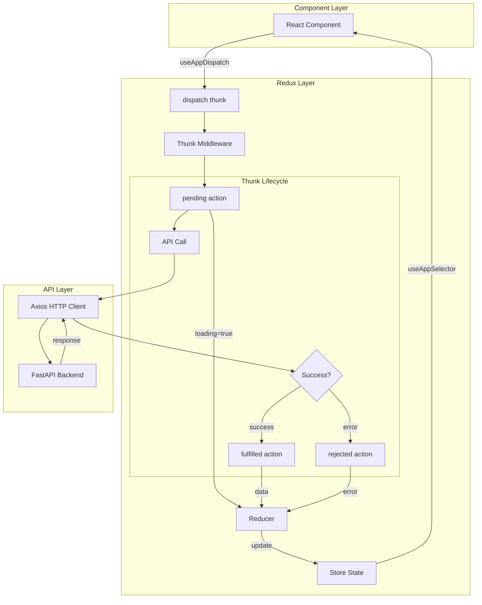
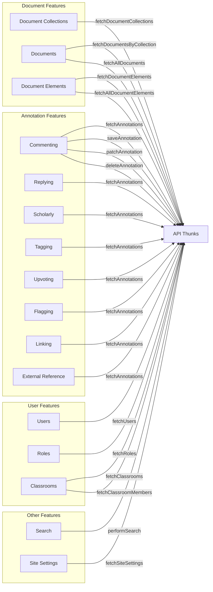
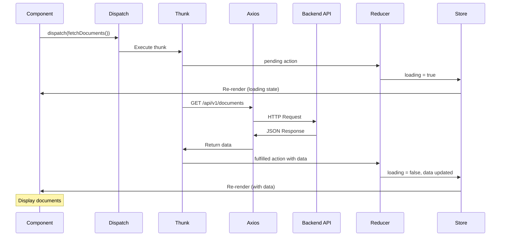

# Redux Store Architecture

**Project:** Genji Document Annotation Platform  
**State Management:** Redux Toolkit 2.6.1

---

## Table of Contents

1. [Store Overview](#store-overview)
2. [Slice Details](#slice-details)
3. [Thunks & Async Actions](#thunks--async-actions)
4. [Selectors](#selectors)
5. [Usage Patterns](#usage-patterns)
6. [Best Practices](#best-practices)

---

## Store Overview

### Store Structure

The Redux store uses a **normalized state pattern** with 15 slices managing different domains of the application state.

```typescript
{
  annotations: {
    commenting: { byId, byParent, loading, error },
    replying: { byId, byParent, loading, error },
    scholarly: { byId, byParent, loading, error },
    tagging: { byId, byParent, loading, error },
    upvoting: { byId, byParent, loading, error },
    flagging: { byId, byParent, loading, error },
    linking: { byId, byParent, loading, error },
    external_reference: { byId, byParent, loading, error }
  },
  highlightRegistry: { positions: {} },
  createAnnotation: { target, isActive, mode },
  documentElements: { byId, bulkLoading },
  documentCollections: { byId, allIds, loading },
  documents: { byId, allIds, loading },
  documentNavigation: { collectionId, documentId },
  users: { byId, allIds, loading },
  roles: { roles, permissions },
  siteSettings: { settings },
  classrooms: { byId, members, loading },
  searchResults: { results, query, loading },
  navigationHighlight: { elementId, type }
}
```

### Configuration

**File:** `src/store/index.ts`

```typescript
export const store = configureStore({
  reducer: rootReducer,
  devTools: true,  // Redux DevTools enabled
});
```

---

## Slice Details

### Annotations Slice (Composite)

**Purpose:** Manages annotations organized by motivation type  
**Pattern:** Factory pattern creating 8 identical slice structures  
**File:** `src/store/slice/annotationSlices.ts`, `factory/createAnnotationSlice.ts`

#### State Structure
```typescript
interface AnnotationState {
  byId: Record<string, Annotation>;      // { annotationId: Annotation }
  byParent: Record<string, string[]>;   // { elementId: [annotationIds] }
  loading: boolean;
  error: string | null;
}
```

#### Motivation Types
1. **commenting** - General comments
2. **replying** - Replies to other annotations
3. **scholarly** - Academic/scholarly notes
4. **tagging** - Tags and labels
5. **upvoting** - Likes/votes
6. **flagging** - Content flags/reports
7. **linking** - Cross-document links
8. **external_reference** - External citations

#### Actions
```typescript
// Add multiple annotations
addAnnotations(annotations: Annotation[])

// Add single annotation  
addAnnotation(annotation: Annotation)

// Remove annotation
deleteAnnotation(annotationDelete: AnnotationDelete)
```

#### Thunks
```typescript
// Fetch annotations for a document element
fetchAnnotations({ documentElementId, classroomId? })

// Create new annotation
saveAnnotation({ annotation, classroomId? })

// Update annotation body
patchAnnotation({ annotationId, payload: { body } })

// Delete annotation
deleteAnnotation({ annotationId })
```

#### Selectors
```typescript
selectAnnotationById(state, id)
selectAnnotationsById(state, ids[])
selectAllAnnotations(state)
selectAnnotationsByParent(state, documentElementId)
makeSelectAnnotationsById()
makeSelectAnnotationsByParent()
```

---

### Document Collections Slice

**Purpose:** Manages document collection metadata  
**File:** `src/store/slice/documentCollectionSlice.ts`

#### State
```typescript
{
  byId: Record<number, DocumentCollection>,
  allIds: number[],
  loading: boolean,
  error: string | null
}
```

#### Thunks
```typescript
fetchDocumentCollections({ includeUsers: boolean })
```

---

### Documents Slice

**Purpose:** Manages document metadata  
**File:** `src/store/slice/documentSlice.ts`

#### State
```typescript
{
  byId: Record<number, Document>,
  allIds: number[],
  loading: boolean,
  error: string | null
}
```

#### Types
```typescript
interface Document {
  id: number;
  title: string;
  collection_id: number;
  created: string;
  modified: string;
  metadata?: Record<string, any>;
}
```

#### Thunks
```typescript
fetchAllDocuments()
fetchDocumentsByCollection(collectionId: number)
```

---

### Document Elements Slice

**Purpose:** Manages paragraph-level document content  
**File:** `src/store/slice/documentElementsSlice.ts`

#### State
```typescript
{
  byId: Record<number, DocumentElement>,
  bulkLoading: {
    [documentId]: boolean  // Track loading per document
  },
  loading: boolean,
  error: string | null
}
```

#### Thunks
```typescript
// Fetch all elements for one document
fetchDocumentElements(documentId: number)

// Bulk fetch elements for multiple documents
fetchAllDocumentElements({
  documentIds: number[],
  loadingCallback?: (id: number, loading: boolean) => void
})
```

#### Advanced Feature: Bulk Loading
Supports loading multiple documents simultaneously with per-document loading states.

---

### Document Navigation Slice

**Purpose:** Tracks current viewing context  
**File:** `src/store/slice/documentNavigationSlice.ts`

#### State
```typescript
{
  collectionId: number | null,
  documentId: number | null
}
```

#### Actions
```typescript
setSelectedCollectionId(collectionId: number)
setSelectedDocumentId(documentId: number)
clearNavigation()
```

---

### Highlight Registry Slice

**Purpose:** Manages annotation highlight positions on screen  
**File:** `src/store/slice/highlightRegistrySlice.ts`

#### State
```typescript
{
  [annotationId]: {
    positions: Array<{
      left: number,
      top: number,
      width: number,
      height: number
    }>,
    motivation: string
  }
}
```

#### Actions
```typescript
updateHighlightPosition({
  annotationId,
  positions: Position[],
  motivation
})

clearHighlightPositions(annotationId)
setHoveredHighlights({ documentId, highlightIds })
```

---

### Create Annotation Slice

**Purpose:** Manages annotation creation UI state  
**File:** `src/store/slice/annotationCreate.ts`

#### State
```typescript
{
  target: {
    documentId: number | null,
    documentElementId: number | null,
    segments: Array<{
      start: number,
      end: number,
      text: string
    }>
  },
  isActive: boolean,
  mode: 'selection' | 'complete' | null
}
```

#### Actions
```typescript
initSelection({ documentId, documentElementId })
addSelectionSegment({ start, end, text })
completeSelection()
cancelSelection()
```

---

### Users Slice

**Purpose:** Manages user data  
**File:** `src/store/slice/usersSlice.ts`

#### State
```typescript
{
  byId: Record<number, User>,
  allIds: number[],
  loading: boolean,
  error: string | null
}
```

#### Thunks
```typescript
fetchUsers()
fetchUserById(userId: number)
```

---

### Roles Slice

**Purpose:** Manages roles and permissions  
**File:** `src/store/slice/rolesSlice.ts`

#### State
```typescript
{
  roles: Role[],
  permissions: Permission[],
  loading: boolean,
  error: string | null
}
```

#### Thunks
```typescript
fetchRoles()
fetchPermissions()
```

---

### Site Settings Slice

**Purpose:** Application configuration  
**File:** `src/store/slice/siteSettingsSlice.ts`

#### State
```typescript
{
  settings: {
    [key: string]: any
  },
  loading: boolean,
  error: string | null
}
```

#### Thunks
```typescript
fetchSiteSettings()
updateSiteSetting({ key, value })
```

---

### Classrooms Slice

**Purpose:** Classroom management  
**File:** `src/store/slice/classroomsSlice.ts`

#### State
```typescript
{
  byId: Record<number, Classroom>,
  members: {
    [classroomId]: ClassroomMember[]
  },
  loading: boolean,
  error: string | null
}
```

#### Types
```typescript
interface Classroom {
  id: number;
  name: string;
  description?: string;
  created: string;
  join_period_start?: string;
  join_period_end?: string;
  classroom_period_start?: string;
  classroom_period_end?: string;
}

interface ClassroomMember {
  id: number;
  user_id: number;
  classroom_id: number;
  role: string;
  first_name: string;
  last_name: string;
}
```

#### Thunks
```typescript
fetchClassrooms()
createClassroom(classroom: ClassroomCreate)
fetchClassroomMembers(classroomId: number)
```

---

### Search Results Slice

**Purpose:** Search state management  
**File:** `src/store/slice/searchResultsSlice.ts`

#### State
```typescript
{
  results: SearchResult[],
  query: string,
  loading: boolean,
  error: string | null
}
```

#### Actions
```typescript
setSearchResults(results: SearchResult[])
setSearchQuery(query: string)
clearSearch()
```

---

### Navigation Highlight Slice

**Purpose:** Manages scroll-to-element highlighting  
**File:** `src/store/slice/navigationHighlightSlice.ts`

#### State
```typescript
{
  elementId: string | null,
  type: 'search' | 'navigation' | null
}
```

#### Actions
```typescript
setNavigationHighlight({ elementId, type })
clearNavigationHighlight()
```

#### Selectors
```typescript
selectIsElementHighlighted(elementId)
selectHighlightType(elementId)
```

---

## Thunks & Async Actions

### Thunk Architecture Overview



### Thunk Usage by Feature



### Thunk Data Flow



### Thunk Pattern

All async actions use `createAsyncThunk` from Redux Toolkit:

```typescript
export const fetchDocumentCollections = createAsyncThunk(
  'documentCollections/fetch',
  async ({ includeUsers }: { includeUsers: boolean }, { rejectWithValue }) => {
    try {
      const params = includeUsers ? { include_users: true } : {};
      const response = await axios.get('/api/v1/collections', { params });
      return response.data;
    } catch (error) {
      return rejectWithValue(error.response?.data || 'Failed to fetch');
    }
  }
);
```

### Lifecycle Actions

Each thunk automatically generates 3 actions:

```typescript
fetchDocumentCollections.pending   // loading = true
fetchDocumentCollections.fulfilled // loading = false, data updated
fetchDocumentCollections.rejected  // loading = false, error set
```

### Common Thunks

#### Document-Related
```typescript
fetchDocumentCollections({ includeUsers })
fetchDocumentsByCollection(collectionId)
fetchAllDocuments()
fetchDocumentElements(documentId)
fetchAllDocumentElements({ documentIds, loadingCallback })
```

#### Annotation-Related
```typescript
fetchAnnotationByMotivation({ documentElementId, motivation, classroomId })
saveAnnotation({ annotation, classroomId })
patchAnnotation({ annotationId, payload })
deleteAnnotation({ annotationId })
```

#### User/Admin
```typescript
fetchUsers()
fetchRoles()
fetchClassrooms()
fetchClassroomMembers(classroomId)
```

---

## Selectors

### Basic Selectors

Direct state access:

```typescript
// Get entire slice
const allDocuments = (state: RootState) => state.documents;

// Get specific field
const selectAllIds = (state: RootState) => state.documents.allIds;
```

### Memoized Selectors

Using `createSelector` for derived data:

```typescript
export const selectAllDocuments = createSelector(
  [(state: RootState) => state.documents.byId],
  (byId) => Object.values(byId)
);

export const selectDocumentById = createSelector(
  [
    (state: RootState) => state.documents.byId,
    (_, documentId: number) => documentId
  ],
  (byId, documentId) => byId[documentId]
);
```

### Combined Selectors

Cross-slice data combinations:

```typescript
export const selectAllAnnotationsForParagraph = createSelector(
  [
    (state: RootState) => state.annotations,
    (_, paragraphId: string) => paragraphId
  ],
  (annotations, paragraphId) => {
    // Combine all annotation types for this paragraph
    return Object.values(annotations).flatMap(bucket => 
      (bucket.byParent[paragraphId] || []).map(id => bucket.byId[id])
    ).filter(Boolean);
  }
);
```

### Factory Selectors

For components that need multiple instances:

```typescript
export const makeSelectAnnotationsByParent = () => createSelector(
  [
    (state: RootState, motivation: string) => state.annotations[motivation],
    (_, __, paragraphId: string) => paragraphId
  ],
  (bucket, paragraphId) => {
    const ids = bucket.byParent[paragraphId] || [];
    return ids.map(id => bucket.byId[id]);
  }
);

// Usage in component
const selectAnnotations = useMemo(() => makeSelectAnnotationsByParent(), []);
const annotations = useAppSelector(state => 
  selectAnnotations(state, 'commenting', paragraphId)
);
```

---

## Usage Patterns

### In Components

#### Reading State

```typescript
import { useAppSelector } from '@store';
import { selectAllDocuments } from '@store';

const MyComponent = () => {
  const documents = useAppSelector(selectAllDocuments);
  const loading = useAppSelector(state => state.documents.loading);
  
  return <div>{documents.map(...)}</div>;
};
```

#### Dispatching Actions

```typescript
import { useAppDispatch } from '@store';
import { fetchDocumentCollections } from '@store';

const MyComponent = () => {
  const dispatch = useAppDispatch();
  
  useEffect(() => {
    dispatch(fetchDocumentCollections({ includeUsers: false }));
  }, [dispatch]);
};
```

#### Handling Async States

```typescript
const MyComponent = () => {
  const dispatch = useAppDispatch();
  const { data, loading, error } = useAppSelector(state => ({
    data: selectAllDocuments(state),
    loading: state.documents.loading,
    error: state.documents.error
  }));
  
  useEffect(() => {
    dispatch(fetchDocumentCollections({ includeUsers: false }));
  }, []);
  
  if (loading) return <Spinner />;
  if (error) return <Error message={error} />;
  return <DocumentList documents={data} />;
};
```

### Optimistic Updates

```typescript
const handleSaveAnnotation = async () => {
  // Optimistically add to UI
  dispatch(addAnnotation(newAnnotation));
  
  try {
    // Persist to backend
    const result = await dispatch(saveAnnotation({ 
      annotation: newAnnotation 
    })).unwrap();
    
    // Update with server response (has ID, timestamps)
    dispatch(addAnnotation(result));
  } catch (error) {
    // Rollback on failure
    dispatch(deleteAnnotation({ annotationId: newAnnotation.id }));
    showError('Failed to save annotation');
  }
};
```

### Batching Actions

```typescript
// Load related data in parallel
useEffect(() => {
  Promise.all([
    dispatch(fetchDocumentCollections({ includeUsers: false })),
    dispatch(fetchUsers()),
    dispatch(fetchClassrooms())
  ]);
}, []);
```

---

## Best Practices

### 1. Use Typed Hooks

```typescript
// ✅ Good
import { useAppSelector, useAppDispatch } from '@store';
const documents = useAppSelector(selectAllDocuments);

// ❌ Avoid
import { useSelector, useDispatch } from 'react-redux';
const documents = useSelector(state => state.documents.byId);
```

### 2. Prefer Selectors

```typescript
// ✅ Good - Reusable, testable
export const selectAllDocuments = createSelector(
  [state => state.documents.byId],
  byId => Object.values(byId)
);

// ❌ Avoid - Inline logic
const documents = useAppSelector(state => Object.values(state.documents.byId));
```

### 3. Normalize State

```typescript
// ✅ Good - O(1) lookup
{
  byId: { 1: {...}, 2: {...} },
  allIds: [1, 2]
}

// ❌ Avoid - O(n) lookup
{
  items: [{ id: 1, ... }, { id: 2, ... }]
}
```

### 4. Handle Loading States

```typescript
// ✅ Good
const { data, loading, error } = useAppSelector(state => ({
  data: selectData(state),
  loading: state.slice.loading,
  error: state.slice.error
}));

if (loading) return <Spinner />;
if (error) return <Error />;
return <Content data={data} />;
```

### 5. Avoid Prop Drilling

```typescript
// ✅ Good - Access Redux in child
const ChildComponent = () => {
  const data = useAppSelector(selectData);
  return <div>{data}</div>;
};

// ❌ Avoid - Passing through many layers
<Parent>
  <Middle data={data}>
    <Child data={data} />
  </Middle>
</Parent>
```

### 6. Use Thunks for Side Effects

```typescript
// ✅ Good
const fetchData = createAsyncThunk(
  'data/fetch',
  async () => {
    const response = await axios.get('/api/data');
    return response.data;
  }
);

// ❌ Avoid - Side effects in components
useEffect(() => {
  axios.get('/api/data').then(response => {
    dispatch(setData(response.data));
  });
}, []);
```

### 7. Memoize Expensive Selectors

```typescript
// ✅ Good - Cached between renders
export const selectSortedDocuments = createSelector(
  [selectAllDocuments],
  documents => [...documents].sort((a, b) => a.title.localeCompare(b.title))
);

// ❌ Avoid - Recalculated every render
const sortedDocs = documents.sort(...);
```

---

## Related Documentation

- **[Frontend Overview](OVERVIEW.md)** - Complete frontend architecture
- **[Frontend Audit](../audits/FRONTEND_AUDIT.md)** - Redux-related issues

---

**Maintainers:** Dartmouth ITC Genji Team
