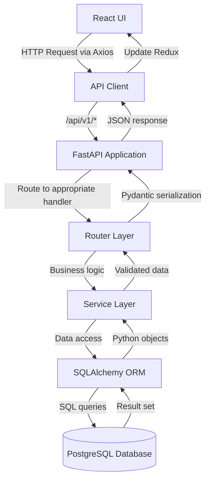
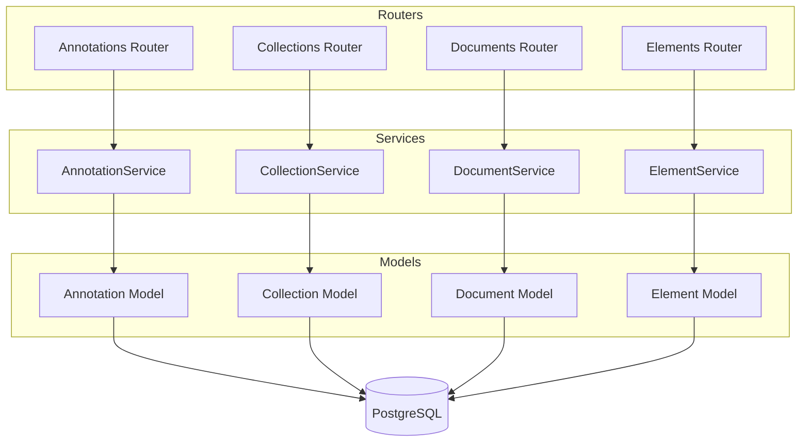
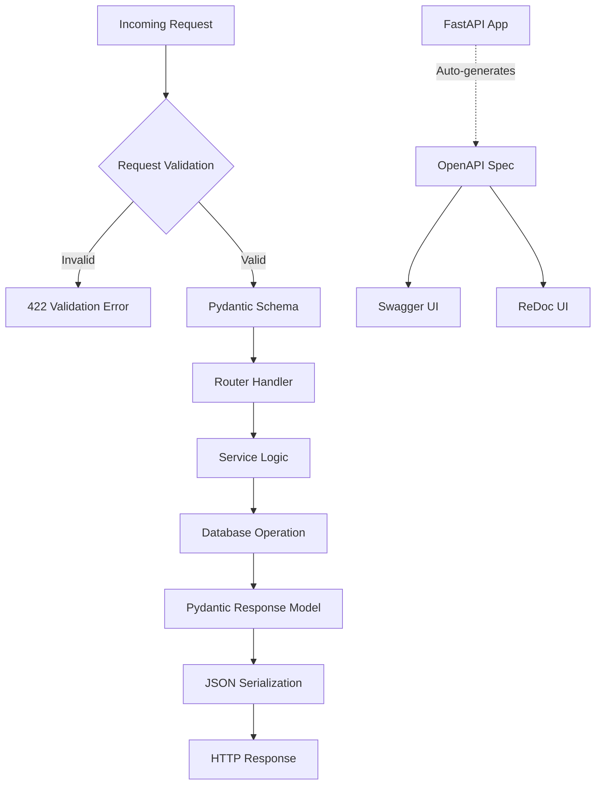

# API Architecture Diagrams

## 1. Request Flow Overview



## 2. Service & Data Layer



## 3. Validation & Documentation


3. Validation & Documentation

```mermaid
flowchart TD
    A[Incoming Request] --> B{Request Validation}
    B -->|Invalid| C[422 Validation Error]
    B -->|Valid| D[Pydantic Schema]
    
    D --> E[Router Handler]
    E --> F[Service Logic]
    F --> G[Database Operation]
    
    G --> H[Pydantic Response Model]
    H --> I[JSON Serialization]
    I --> J[HTTP Response]
    
    API[FastAPI App] -.->|Auto-generates| K[OpenAPI Spec]
    K --> L["Swagger UI at /docs"]
    K --> M["ReDoc UI at /redoc"