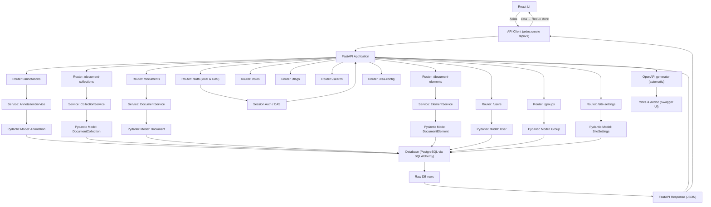

```mermaid
flowchart TD
    %% ---------- UI → API ----------
    A[React UI] -->|Axios| B["API Client (axios.create /api/v1)"]

    %% ---------- API core ----------
    B --> C[FastAPI Application]

    %% ---------- Routers (13 total) ----------
    C --> D[Router: /annotations]
    C --> E[Router: /document-collections]
    C --> F[Router: /documents]
    C --> G[Router: /document-elements]
    C --> H[Router: /users]
    C --> I[Router: /groups]
    C --> J[Router: /roles]
    C --> K[Router: /flags]
    C --> L[Router: /search]
    C --> M[Router: /site-settings]
    C --> N["Router: /auth (local & CAS)"]
    C --> O[Router: /cas-config]

    %% ---------- Security ----------
    N --> P[Session Auth / CAS]
    P --> C

    %% ---------- Services Layer ----------
    D --> Q[Service: AnnotationService]
    E --> R[Service: CollectionService]
    F --> S[Service: DocumentService]
    G --> T[Service: ElementService]

    %% ---------- Validation & Serialization ----------
    Q --> U[Pydantic Model: Annotation]
    R --> V[Pydantic Model: DocumentCollection]
    S --> W[Pydantic Model: Document]
    T --> X[Pydantic Model: DocumentElement]
    H --> Y[Pydantic Model: User]
    I --> Z[Pydantic Model: Group]
    M --> AA[Pydantic Model: SiteSettings]

    %% ---------- Database ----------
    U --> AB["Database (PostgreSQL via SQLAlchemy)"]
    V --> AB
    W --> AB
    X --> AB
    Y --> AB
    Z --> AB
    AA --> AB

    %% ---------- Response flow ----------
    AB --> AC[Raw DB rows]
    AC --> AD["FastAPI Response (JSON)"]
    AD --> C

    %% ---------- OpenAPI / Docs ----------
    C --> AE["OpenAPI generator (automatic)"]
    AE --> AF["/docs & /redoc (Swagger UI)"]

    %% ---------- UI receives data ----------
    AD --> B
    B -->|data → Redux store| A
```
