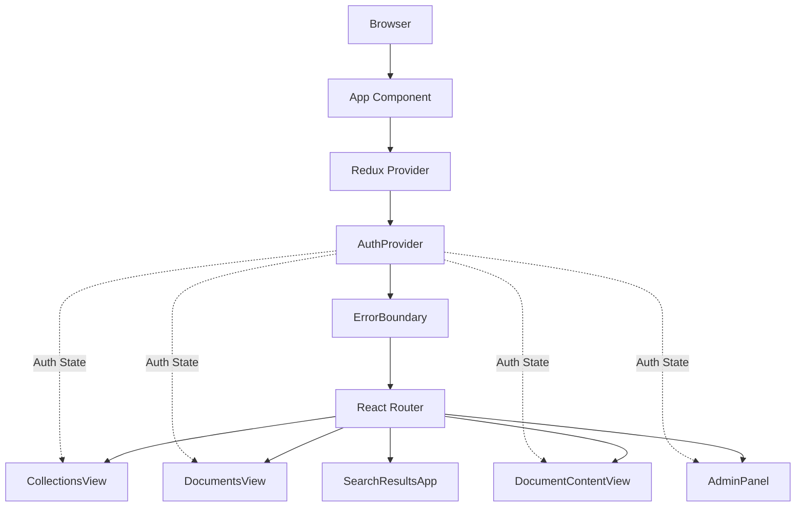
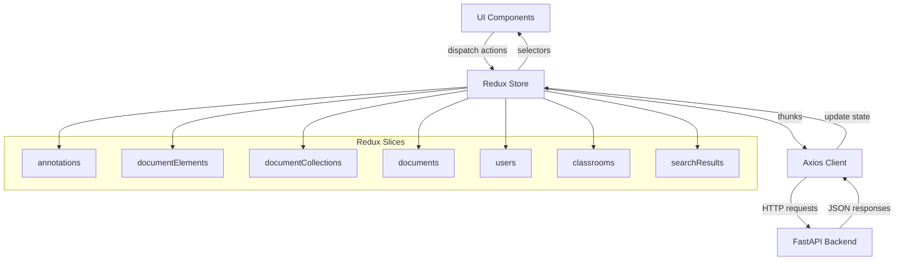
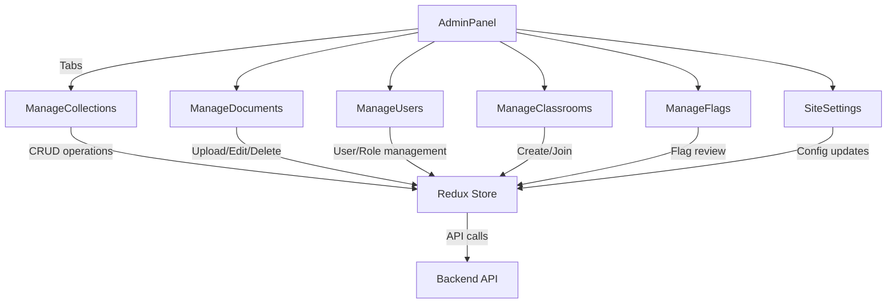
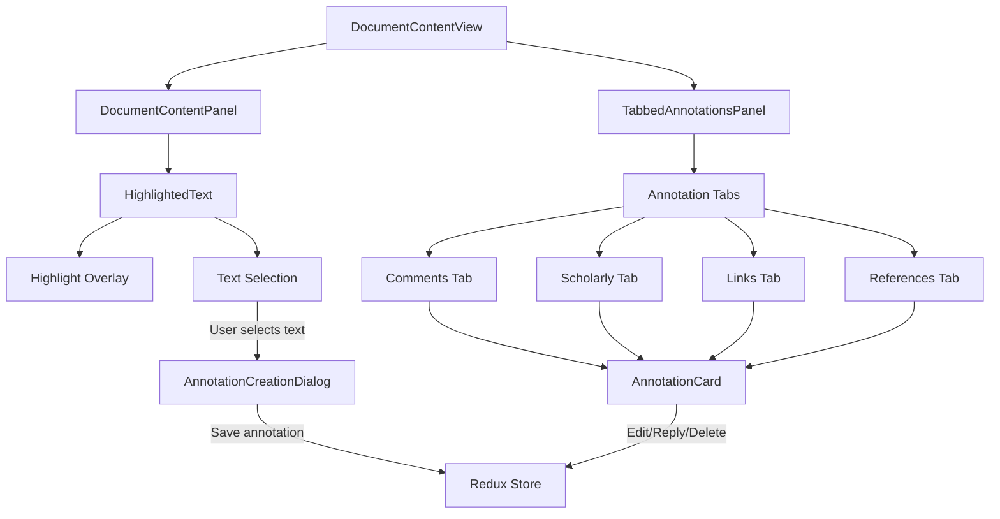
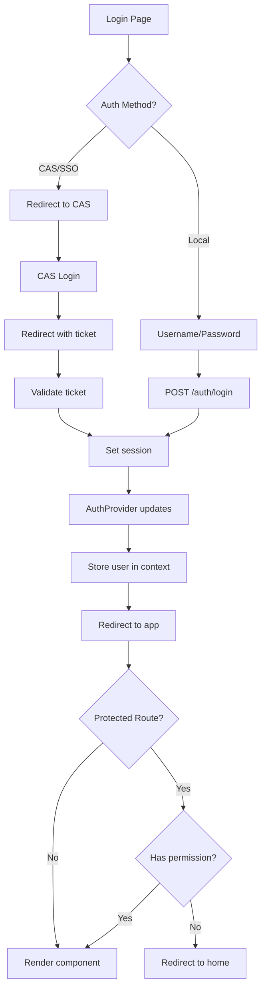

# Frontend UI Architecture Diagrams

## 1. Application Structure

```mermaid
flowchart TD
    A[Browser] --> B[App Component]
    B --> C[Redux Provider]
    C --> D[AuthProvider]
    D --> E[ErrorBoundary]
    E --> F[React Router]
    
    F --> G[CollectionsView]
    F --> H[DocumentsView]
    F --> I[DocumentContentView]
    F --> J[AdminPanel]
    F --> K[SearchResultsApp]
    
    D -.->|Auth State| G
    D -.->|Auth State| H
    D -.->|Auth State| I
    D -.->|Auth State| J
```

## 2. Redux Store & API Integration

```mermaid
flowchart TD
    A[UI Components] -->|dispatch actions| B[Redux Store]
    B -->|thunks| C[Axios Client]
    C -->|HTTP requests| D[FastAPI Backend]
    
    D -->|JSON responses| C
    C -->|update state| B
    B -->|selectors| A
    
    subgraph Redux Slices
        S1[annotations]
        S2[documentElements]
        S3[documentCollections]
        S4[documents]
        S5[users]
        S6[classrooms]
        S7[searchResults]
    end
    
    B --> S1
    B --> S2
    B --> S3
    B --> S4
    B --> S5
    B --> S6
    B --> S7
```

## 3. Admin Panel Components

```mermaid
flowchart TD
    A[AdminPanel] -->|Tabs| B[ManageCollections]
    A --> C[ManageDocuments]
    A --> D[ManageUsers]
    A --> E[ManageClassrooms]
    A --> F[ManageFlags]
    A --> G[SiteSettings]
    
    B -->|CRUD operations| Redux[Redux Store]
    C -->|Upload/Edit/Delete| Redux
    D -->|User/Role management| Redux
    E -->|Create/Join| Redux
    F -->|Flag review| Redux
    G -->|Config updates| Redux
    
    Redux -->|API calls| API[Backend API]
```

## 4. Document View Components

```mermaid
flowchart TD
    A[DocumentContentView] --> B[DocumentContentPanel]
    A --> C[TabbedAnnotationsPanel]
    
    B --> D[HighlightedText]
    D --> E[Highlight Overlay]
    D --> F[Text Selection]
    
    F -->|User selects text| G[AnnotationCreationDialog]
    G -->|Save annotation| Redux[Redux Store]
    
    C --> H[Annotation Tabs]
    H --> I1[Comments Tab]
    H --> I2[Scholarly Tab]
    H --> I3[Links Tab]
    H --> I4[References Tab]
    
    I1 --> J[AnnotationCard]
    I2 --> J
    I3 --> J
    I4 --> J
    
    J -->|Edit/Reply/Delete| Redux
```

## 5. Authentication Flow

```mermaid
flowchart TD
    A[Login Page] --> B{Auth Method?}
    
    B -->|CAS/SSO| C[Redirect to CAS]
    C --> D[CAS Login]
    D --> E[Redirect with ticket]
    E --> F[Validate ticket]
    
    B -->|Local| G[Username/Password]
    G --> H[POST /auth/login]
    
    F --> I[Set session]
    H --> I
    
    I --> J[AuthProvider updates]
    J --> K[Store user in context]
    K --> L[Redirect to app]
    
    L --> M{Protected Route?}
    M -->|Yes| N{Has permission?}
    M -->|No| O[Render component]
    N -->|Yes| O
    N -->|No| P[Redirect to home]
```
